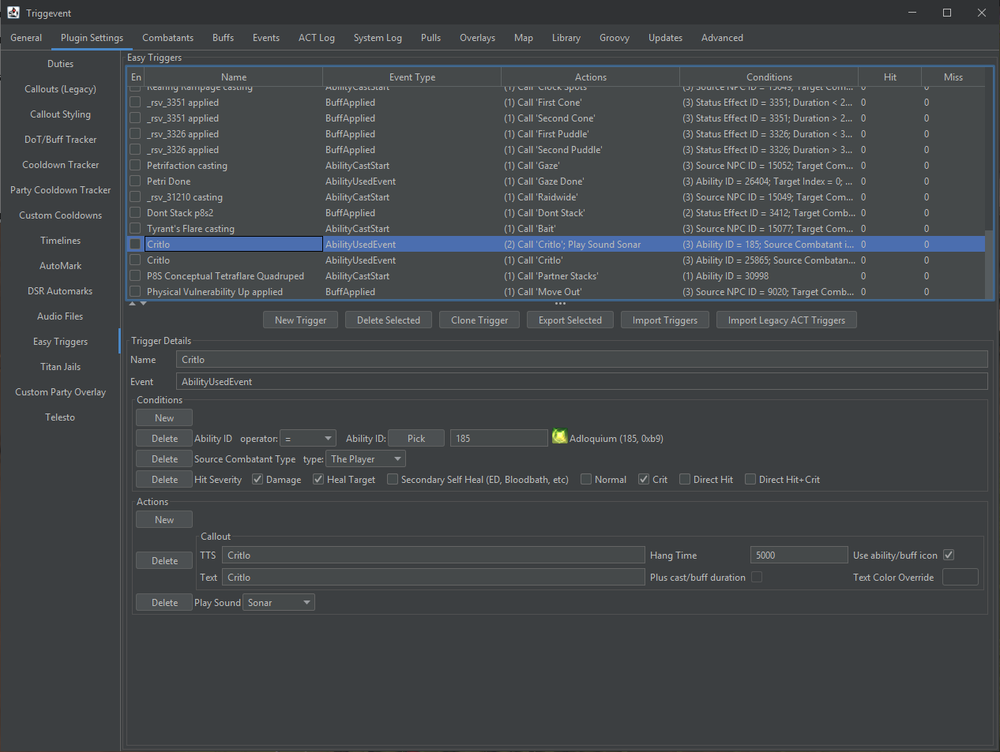
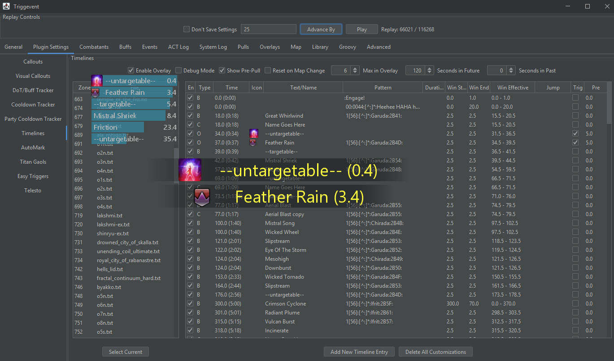
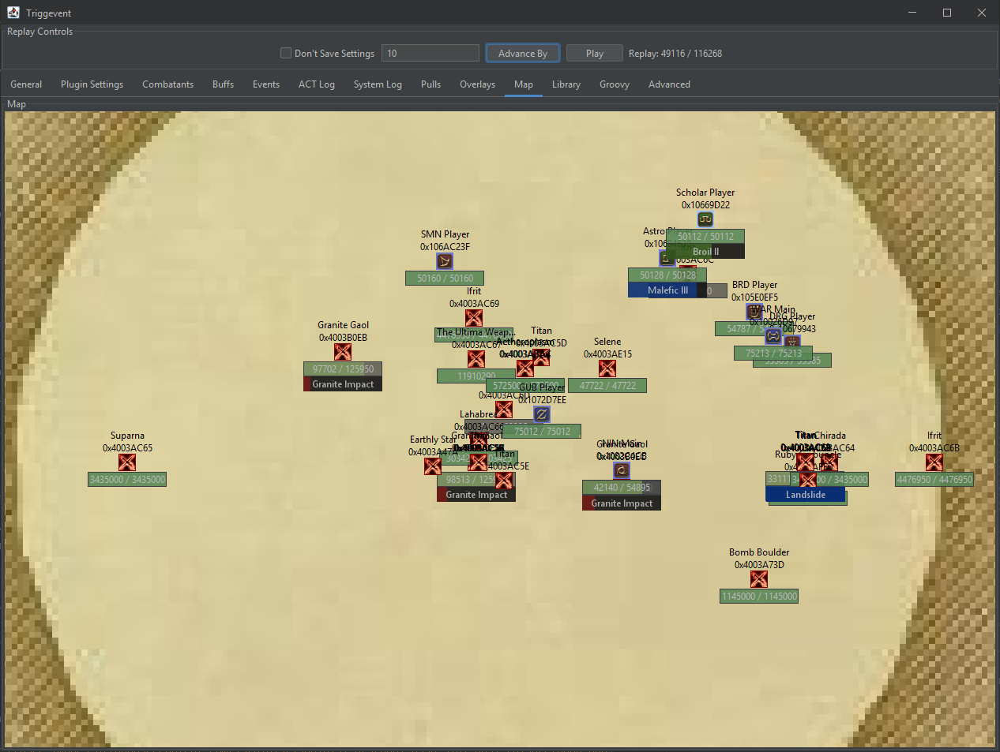

# Triggevent

[Triggevent](https://github.com/xpdota/event-trigger) is an addon for FFXIV.

After using other tools for triggers and overlays for years, I realized that it was time for some major improvements
over the status quo. All this time and we're still making triggers with log lines and regular expressions? Let's
step back a bit and completely rethink things.

[Download Here](https://github.com/xpdota/event-trigger/releases)

(You want the larger file, unless you know you have Java 17+ already installed)

## Current Trigger Status

- [Abyssos](/pages/triggers/Abyssos-Triggers.md): Done
- [Dragonsong's Reprise](/pages/Dragonsong-Triggers.md): Done

### Dragonsong's Reprise (aka Dragonsong War/Dragonsong Ultimate) Trigger Status: Done!

Code documentation (auto-generated) is now
available [here](https://xpdota.github.io/event-trigger/master/javadoc/allclasses-index.html) (replace `master` in the
URL with the branch you are using).

## How to Download/Install

READ THIS: See [Installation](https://github.com/xpdota/event-trigger/wiki/Installation-and-Setup)

Short version: Install OverlayPlugin in your ACT, then start OverlayPlugin WSServer from within ACT.

There is more documentation on the [Wiki](https://github.com/xpdota/event-trigger/wiki/).

## Features

Triggevent is an addon for FFXIV. It offers triggers, overlays, log analysis, and more. It goes above and beyond both in
function and form.

Even if you don't wish to use it as a gameplay addon, it still offers log analysis and replay functions. Even if you're
making overlays or triggers for a different tool, it still offers quite a bit in that regard.

### [Multi-Target DoT Tracker](/pages/Dot-Tracker.md)

One of the built-in overlays is a multi-target DoT tracker. If you care about micro-optimizations, it can even display
tick timing right on the bar.

### [Cooldown Tracker](/pages/Cooldown-Tracker.md)

Shows remaining cooldown as well as active time. There is a separate overlay for personal cooldowns as well as
party cooldowns.

### [Jail Plugin](/pages/Titan-Jail.md)

Triggevent has a reliable and powerful Titan Jail plugin. You choose a priority by dragging and dropping jobs - no
typing names or sharing xml files. It supports personal callouts, as well as automarks, and the automarks can use
either macros or Telesto.

There is more information about the Gaol plugin [here](pages/Titan-Jail.md).

### Triggers

Triggers can be written in the codebase (like Cactbot), giving you all the benefits of a fully featured IDE and
debugger. Or, for simple triggers, they can be made in the UI.

Whichever option you take, you don't need to know about log lines nor regular expressions.

For example, consider this small bit of code here:

Rather than trying to read an obtuse regular expression, the conditions are human readable. This trigger will fire
when we see buff 0xACA, but only when it is directed at the player, and is not a buff refresh/stack count change.
Furthermore, it changes the callout based on the stack count.

What does the "ModifiableCallout" bit do? It lets the user easily modify the callout, similar to Cactbot!

For simple calls, you can also make triggers using easily readable conditions - no regular expressions required!
Plus, since everything is parsed for you, you don't need to worry about log line changes or patches breaking
your trigger.

In some cases, you can right click an event, click "Make Easy Trigger", and it will make one for you:

In addition, any trigger caused by an event with a duration (buffs, castbars) can display a countdown until the
event takes place, in the on-screen callout overlay:

On top of all that, it can even display buff/ability icons in the callout, pulled automatically from game data files!

The end user can further customize the callouts, as they support Groovy expressions. By using conditionals in these,
you can even attack additional conditions, or even completely change the way the callout works:

### Timeline Customization

Triggevent can use Cactbot timelines, but adds customization options.

Via this UI, you can disable built-in entries, add new entries, or modify existing entries.
You can also add icons, and turn any timeline entry into a trigger.

### Log Analysis

Easily access information about events, combatants, and more.

Makes it easier to create triggers and overlays. Even if you're developing triggers for a
different plugin like Cactbot or Triggernometry, this is useful.

The map panel shows you a view of all combatants and what they're casting.

### Replay Support

Triggevent can load data from various sources. In addition to live data from OverlayPlugin WebSocket (plus other live
sources like Telesto), it can also load from an ACT log or FFLogs (with reduced functionality).
Also, if you run it live, you have the option to
record all the data into its own save format. This save format captures all the WS data, so it provides more accurate
combatants data.

To open a replay, simply run triggevent-import.exe (instead of the normal triggevent.exe),
and then choose a file or FFLogs URL. Note that in order to use FFLogs reports, you'll need to have your own API key.

## Future Development

I put most of my upcoming/desired features on the [project board](https://github.com/xpdota/event-trigger/projects/1).

## Why Would I Use This? (Short Version)

### For Normal Users

* Lots of built-in features - jail plugin that doesn't suck, multi target dot+tick tracking, and a lot more
    - Ever wanted to put your entire mit plan, with icons, on a timeline? Now you can.
* Better customizability of callouts without needing to edit triggers
* Extremely easy to make basic triggers - making triggers doesn't require any knowledge of log lines nor regular
  expressions (and shouldn't -
  [because it was never the right tool for the job](https://github.com/xpdota/event-trigger/wiki/Why-is-Regex-Bad-for-Triggers%3F)!)
    - Most of it can be done by right clicking on the event you want to make a trigger from, and selecting "Make Easy
      Trigger". It's not perfect all the time, but you can edit the trigger if anything is off.

### For Developers and Power Users

* Better tools for creating and testing triggers
    - Certain types of triggers can be tested without a log file - you can use an FFLogs report instead!
    - You can write test cases for triggers
* Zero regex means much more readable conditions and triggers
* Much better abstraction of incoming data out of the box
    - Specifically, log lines are parsed into rich objects that can be queried as needed
    - Everything is converted to appropriate data types, both in terms of primitive values (i.e. no more worrying about
      hex/dec conversions), as well as rich types (such as combatants and abilities)
    - Events can be further abstracted into more refined events - for example, Titan Jails have their own event, so
      anyone wanting to provide more forms of Jail plugins need only listen for that specific event.
    - The trigger shouldn't need to worry about any low-level details - it should be abstracted to that absolute
      minimum (e.g. `call out "Raidwide" when ability 0x123 starts casting`)
* Plugins can have their own custom configuration GUIs (see the jail config GUI for a great example)
* Run scripts within the app, for any purpose:
    - Prototyping code that will go inside the app
    - Log analysis
    - Bulk changing of settings and the like

# I Need Help!

Should you require any assistance, you can:

- [File a bug](https://github.com/xpdota/event-trigger/issues)
- Ask on Discord (DM xp#0001 or ping in FFXIV ACT discord - make sure we have a mutual server since I get a lot of spam friend requests)

# Site Map

- [Main Page](/)
- [Frequently Asked Questions](/pages/FAQ.md)
- [Troubleshooting Guide](/pages/Troubleshooting.md)
- [The Problems with Existing Solutions (or: Why I was spurred to make this)](/pages/The-Problems-with-Existing-Solutions.md)
- [How Triggevent is Different](/pages/How-Triggevent-is-Different.md)
- [Telesto Support](/pages/Telesto-Support.md) - Telesto enables easier and better auto markers, and a properly sorted party list.
- [More documentation on the Wiki](https://github.com/xpdota/event-trigger/wiki)
- [Linux Install Guide](/pages/Linux-support.md) - Run natively on Linux, no WINE required.
- [How to Help Out](/pages/How-to-Help.md)
- Overlays and Features:
    - [Cooldown Tracker](/pages/Cooldown-Tracker.md) - Personal + Party Cooldown tracker.
    - [DoT Tracker](/pages/Dot-Tracker.md) - Multi-target DoT tracker + DoT tick tracker.
    - [Timeline Customization](/pages/Timeline-Customization.md) - Triggevent's extensions of Cactbot Timelines.
    - [General Automarker Info](/pages/Automarkers.md) - General info for automarks (Wroth Flames and UWU auto markers have their own pages below).
- Specific Duties:
    - [Titan Gaol Guide](/pages/Titan-Jail.md) - Setup guide for UWU auto markers and jail plugin callouts.
    - [Dragonsong Triggers, including Wroth Flames Automarker](/pages/Dragonsong-Triggers.md) - Overview of DSR callouts and wroth flames auto marks.
    - [Abyssos Triggers](/pages/triggers/Abyssos-Triggers.md)
- For Devs:
    - [How to make a new module](/pages/Custom-Module.md) - How to stand up a new module from scratch
    - [Javadocs](https://xpdota.github.io/event-trigger/master/javadoc/allclasses-index.html) for devs (replace 'master' in the URL with the desired branch)
- General Log Documentation:
    - [Finding Percentages of Vulns/Buffs/Etc](/pages/tutorials/Damage-Down-Up.md) - How to find damage up/damage down/vuln/etc percentages in a log.

