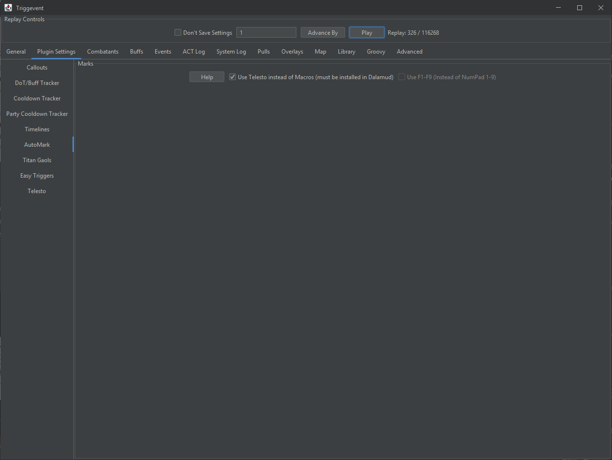
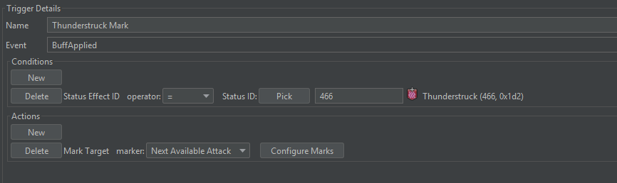
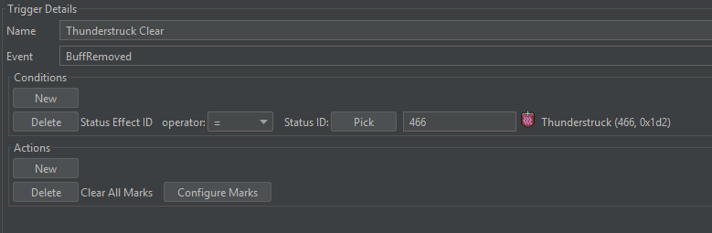

# Automarkers

This page is a general overview of how FFXIV automarkers work in Triggevent. For information on 
automarkers for specific duties, please visit the relevant pages:
- For UWU Titan Jail auto markers specifically, visit the [Titan Jail](Titan-Jail.md) page.
- For DSR Wroth Flames auto marks, visit the [Dragonsong's Reprise](Dragonsong-Triggers.md) page. 
  - There is also a thunderstruck automarker, and Easy Triggers make it trivial to build your own automarkers for other mechanics such as Doom.
- For The Omega Protocol (Ultimate) marks, visit the [Omega Protocol](/pages/triggers/The-Omega-Protocol-Ultimate.md) page. It currently includes:
  - Looper nth in line debuff automarker
  - Pantokrator nth in line debuff automarker
  - Party Synergy/Playstation head markers automarks - separate customization for mid/remote
  - Sniper Cannon (P3 transition) automarkers
  - Monitor automark

This page covers general setup and development of new automarks.



Automarkers in Triggevent can use classic-style macros, or [Telesto](Telesto-Support.md). Telesto-based
automarks can use any available marker (attack, bind, ignore, shapes). Macro-based markers will only
work for applying sequential 'attack' markers (e.g. attack1, attack2, and attack3 for UWU Titan Gaols).

Generally, Telesto is the preferred method, but I will go over both options.

## Macro Setup

To set up the gaol macros (or whatever you plan to use automarkers for), create eight macros of this form:

First Macro:

```
/e Marker1
/mk attack <1>
```

Second Macro:

```
/e Marker2
/mk attack <2>
```

...and so on, through the eighth macro:

```
/e Marker8
/mk attack <8>
```

Finally, the ninth macro:

```
/e Clear Markers
/mk clear <1>
/mk clear <2>
/mk clear <3>
/mk clear <4>
/mk clear <5>
/mk clear <6>
/mk clear <7>
/mk clear <8>
```

The `/e` lines are not strictly required, but are very helpful for debugging in case something goes wrong.

Then, put these nine macros on a hotbar, and bind the bar to either Numpad1-9, or F1-F9. Then, in Triggevent's
automarker setup page (shown above), uncheck "Use Telesto", and check or uncheck "Use F1-F9" based on which
hotkeys you'd rather use.

## Telesto Setup

Follow the instructions on the [Telesto Support](Telesto-Support.md) page. There are no other settings needed.

## Duty-Specific Setup

Once you have either Telesto or macros set up, you'll want to make sure you have enabled and configured the
specific automark triggers you wish to use. For UWU Titan Gaol automarks, see the [Titan Jail](Titan-Jail.md) page.
For DSR Wroth Flames, visit the [Dragonsong's Reprise](Dragonsong-Triggers.md) page.

# Making your own Automarks using Easy Triggers

There is now a "Mark Target" action available for use in Easy Triggers:

You must use an event type (such as a buff or ability use) that has a target. The action will throw the specified
marker onto said target:


"Next Available Attack" means to just use `/mk attack <target>` - it will sequentially mark people.

For example, if you wanted to mark people with the Thunderstruck debuff (i.e. re-create the UCoB Nael Lightning AM):





# Dev Info

If you wish to create your own automarker triggers, both the Titan Jail and Wroth Flames automarks are great
examples. The Titan Jail trigger is in `JailSolver.java`, and sends requests like this (the list of players to
mark is already solved at this point):

[//]: # (@formatter:off)
```java
List<XivPlayerCharacter> playersToMark = event.getJailedPlayers();
context.accept(new AutoMarkRequest(playersToMark.get(0)));
context.accept(new AutoMarkRequest(playersToMark.get(1)));
context.accept(new AutoMarkRequest(playersToMark.get(2)));
ClearAutoMarkRequest clear = new ClearAutoMarkRequest();
clear.setDelayedEnqueueOffset(jailClearDelay.get());
context.enqueue(clear);
```
[//]: # (@formatter:on)

This will drop sequential 'attack' markers (i.e. attack1, attack2, attack3 assuming there are no existing marks),
then clear them after a user-configurable delay.

The fancy configuration UI is defined in `JailGui.java`.

For Wroth Flames, it is a bit more advanced, but the core difference is that instead of `AutoMarkRequest`, we use
`SpecificAutoMarkRequest` and supply a specific marker to use (from the `MarkerSign` enum):

[//]: # (@formatter:off)
```java
List<XivPlayerCharacter> spreaders = playerMechs.get(WrothFlamesRole.SPREAD);
List<XivPlayerCharacter> stackers = playerMechs.get(WrothFlamesRole.STACK);
List<XivPlayerCharacter> otherStackers = playerMechs.get(WrothFlamesRole.NOTHING);

// Give out markers
spreaders.forEach(player -> s.accept(new SpecificAutoMarkRequest(player, MarkerSign.ATTACK_NEXT)));

boolean altMode = getP6_altMarkMode().get();

// People might be dead, so check count
if (stackers.size() >= 1 && otherStackers.size() >= 1) {
    s.accept(new SpecificAutoMarkRequest(stackers.get(0), MarkerSign.BIND1));
    s.accept(new SpecificAutoMarkRequest(otherStackers.get(0), altMode ? MarkerSign.BIND2 : MarkerSign.IGNORE1));
}
if (stackers.size() >= 2 && otherStackers.size() >= 2) {
    s.accept(new SpecificAutoMarkRequest(stackers.get(1), altMode ? MarkerSign.IGNORE1 : MarkerSign.BIND2));
    s.accept(new SpecificAutoMarkRequest(otherStackers.get(1), MarkerSign.IGNORE2));
}
else {
    // but still warn that something went wrong
    log.warn("Wroth: Not enough stackers! With buff: {}, without: {}", stackers, otherStackers);
}
```
[//]: # (@formatter:on)

The configuration UI is in `DragonsongGui.java`.