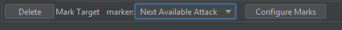

# Automarkers

This page is a general overview of how FFXIV automarkers work in Triggevent. For information on 
automarkers for specific duties, please visit the relevant pages:
- For UWU Titan Jail auto markers specifically, visit the [Titan Jail](Titan-Jail.md) page.
  - This acts as a unified replacement both for the various triggernometry-based markers, as well as the standalone jail plugin.
- For DSR Wroth Flames auto marks, visit the [Dragonsong's Reprise](Dragonsong-Triggers.md) page. 
  - There is also a Dragonsong thunderstruck automarker, and Easy Triggers make it trivial to build your own automarkers for other mechanics such as Doom.
- For The Omega Protocol (Ultimate) marks, visit the [Omega Protocol](triggers/The-Omega-Protocol-Ultimate.md) page. It currently includes:
  - Looper nth in line debuff automarker
  - Pantokrator nth in line debuff automarker
  - Party Synergy/Playstation head markers automarks - separate customization for mid/remote
  - Sniper Cannon (P3 transition) automarkers
  - Monitor automark

This page covers general setup of automarks, as well as information on how to make new automarkers.


Automarkers in Triggevent can use classic-style macros, or [Telesto](Telesto-Support.md). Telesto-based
automarks can use any available marker (attack, bind, ignore, shapes). Macro-based markers will only
work for applying sequential 'attack' markers (e.g. attack1, attack2, and attack3 for UWU Titan Gaols).

Generally, Telesto is the preferred method, but I will go over both options.

## Macro Setup

To set up the gaol macros (or whatever you plan to use automarkers for), create eight macros of this form:

First Macro:

```
/e Marker1
/mk attack <1>
```

Second Macro:

```
/e Marker2
/mk attack <2>
```

...and so on, through the eighth macro:

```
/e Marker8
/mk attack <8>
```

Finally, the ninth macro:

```
/e Clear Markers
/mk clear <1>
/mk clear <2>
/mk clear <3>
/mk clear <4>
/mk clear <5>
/mk clear <6>
/mk clear <7>
/mk clear <8>
```

The `/e` lines are not strictly required, but are very helpful for debugging in case something goes wrong.

Then, put these nine macros on a hotbar, and bind the bar to either Numpad1-9, or F1-F9. Then, in Triggevent's
automarker setup page (shown above), uncheck "Use Telesto", and check or uncheck "Use F1-F9" based on which
hotkeys you'd rather use.

## Telesto Setup

Follow the instructions on the [Telesto Support](Telesto-Support.md) page. There are no other settings needed.

## Duty-Specific Setup

Once you have either Telesto or macros set up, you'll want to make sure you have enabled and configured the
specific automark triggers you wish to use. For UWU Titan Gaol automarks, see the [Titan Jail](Titan-Jail.md) page.
For DSR Wroth Flames, visit the [Dragonsong's Reprise](Dragonsong-Triggers.md) page.

# Making your own Automarks using Easy Triggers

There is now a "Mark Target" action available for use in Easy Triggers:

You must use an event type (such as a buff or ability use) that has a target. The action will throw the specified
marker onto said target:



"Next Available Attack" means to just use `/mk attack <target>` - it will sequentially mark people.

For example, if you wanted to mark people with the Thunderstruck debuff (i.e. re-create the UCoB Nael Lightning AM):


# Making your own Automarks with Scripts

## Entirely Scripted Trigger

You can now write a complete trigger entirely within Groovy. See [Groovy Scripting](groovy/Groovy-Scripting.md) for more
details.

You'll need to use `groovyTriggers.add` to register the trigger. You'll also need to run the script at least once so
that it registers. Running the script again will replace the old trigger, assuming you keep the `named` parameter the same.
To make it persistent, check the "Run on Startup" box.

Here's an example for TOP P3 transition (sniper cannon):

```groovy
// Define priority
prio = [Job.SCH, Job.DRK, Job.MNK, Job.DRG, Job.DNC, Job.SMN, Job.GNB, Job.SGE]

def mark(player, sign) {
	eventMaster.pushEvent(new SpecificAutoMarkRequest(player, sign))
}

// Define our function
def sniperAM(dryRun = false) {
	log.info "Sniper AM Start"
	// Get party list
	party = state.partyList
	// Sort party list according to our priority
	party.sort { member -> prio.indexOf(member.job) }

	// Start with empty lists for each mechanic
	sniper = []
	hpSniper = []
	nothing = []
	// Categorize players according to their debuff
	party.each { member -> 
		if (statusEffectRepository.isStatusOnTarget(member, 0xD61)) {
			sniper += member
		}
		else if (statusEffectRepository.isStatusOnTarget(member, 0xD62)) {
			hpSniper += member
		}
		else {
			nothing += member
		}
	}
	log.info "Sniper: {}, HP: {}, Nothing: {}", sniper, hpSniper, nothing
	// Trigger the AMs
	if (!dryRun) {
		sniper.each { player -> mark player, MarkerSign.ATTACK_NEXT }
		mark hpSniper[0], MarkerSign.BIND1
		mark hpSniper[1], MarkerSign.IGNORE1
		mark nothing[0], MarkerSign.BIND2
		mark nothing[1], MarkerSign.IGNORE2
	}
	log.info "Sniper AM Done"
	// For testing, return the values
	return ["Sniper": sniper.collect{it.name}, "High Power Sniper": hpSniper.collect{it.name}, "Nothing": nothing.collect{it.name}]
}


// The actual trigger
groovyTriggers.add {
	// Name should be unique
	named "Sniper Cannon AM"
	type BuffApplied
	when { it.buffIdMatches(0xD61) }
	sequence { e1, s -> 
		s.waitMs(100)
		sniperAM()
	}
}

// Run the function once. This isn't strictly needed, but helps with performance, 
// and also will be more likely to discover any problems in your function before
// running it for real.
// The dryRun parameter causes it to not actually do any marking. For testing
// the script, you'd want to import a log, play it until the part where you'd expect
// the AM to fire, and then you can run this as many times as needed.
// This also returns the data, so you can inspect it in the Groovy tab.
sniperAM(true)
```

## Hybrid Easy Trigger/Scripted

See the Easy Triggers [Script Action](tutorials/Easy-Triggers.md#advanced-scripting) for more details.
It is generally cleaner and easier to write the trigger purely in scripts.

The short version is, you can write a script to handle automarkers, and call that script from an Easy Trigger.
Here is an example of how one might implement the TOP Sniper Cannon automarker with a script:

```groovy
import gg.xp.xivsupport.events.triggers.marks.adv.*
// Define priority
prio = [Job.SCH, Job.DRK, Job.MNK, Job.DRG, Job.DNC, Job.SMN, Job.GNB, Job.SGE]

def mark(player, sign) {
	eventMaster.pushEvent(new SpecificAutoMarkRequest(player, sign))
}

// Define our function
globals.sniperAM = { dryRun = false ->
	log.info "Sniper AM Start"
	// Get party list
	party = state.partyList
	// Sort party list according to our priority
	party.sort { member -> prio.indexOf(member.job) }

	// Start with empty lists for each mechanic
	sniper = []
	hpSniper = []
	nothing = []
	// Categorize players according to their debuff
	party.each { member -> 
		if (statusEffectRepository.isStatusOnTarget(member, 0xD61)) {
			sniper += member
		}
		else if (statusEffectRepository.isStatusOnTarget(member, 0xD62)) {
			hpSniper += member
		}
		else {
			nothing += member
		}
	}
	log.info "Sniper: {}, HP: {}, Nothing: {}", sniper, hpSniper, nothing
	// Trigger the AMs
	if (!dryRun) {
		sniper.each { player -> mark(player, MarkerSign.ATTACK_NEXT) }
		hpSniper.each { player -> mark(player, MarkerSign.IGNORE_NEXT) }
		nothing.each { player -> mark(player, MarkerSign.BIND_NEXT) }
	}
	log.info "Sent Marks"
	return ["Sniper": sniper.collect{it.name}, "High Power Sniper": hpSniper.collect{it.name}, "Nothing": nothing.collect{it.name}]
}
// Leave this here 
globals.sniperAM.call(true)
```

Be sure to run the script, and also enable "Run on Startup" to have it work automatically without the need to run the script.

Notice how we've assigned our script to `globals.sniperAM` - this means we can reference it via a groovy easy trigger action:


This trigger will:
1. Clear existing markers
2. Wait 100ms (so that the other buffs have time to appear)
3. Execute our custom script
4. Wait 20 seconds
5. Clear markers again

The actual script is quite simple - establish a job priority, sort the party list according to that priority,
then check what debuffs each player has and assign markers accordingly. Because Triggevent tracks all buffs and debuffs
for you, you can simply query whether or not a player has a particular status effect, rather than needing a separate trigger
to collect buffs.

Here's another example, this time a Run: Dynamis trigger, which will first mark people with one stack of dynamis who do not have
the "first in line" buff. Then, it will mark people with two stacks of dynamis who have neither first nor second in line, and will
never mark more than four people in total:

```groovy
import gg.xp.xivsupport.events.triggers.marks.adv.*

toClear = []

def mark(player, sign) {
	eventMaster.pushEvent(new SpecificAutoMarkRequest(player, sign))
	toClear += player
}

// Define our function
globals.dynAM = { dryRun = false ->
	log.info "Dynamis AM Start"
	// Get party list
	party = state.partyList
	// Sort party list according to our priority
	party.sort { member -> buffs.buffStacksOnTarget(member, 3444) }
	limit = 4
	// Mark people with two stacks
	party.each { member ->
		if (limit <= 0) {
			log.info "Skipping mark, hit limit"
			return
		}
		if ((buffs.buffStacksOnTarget(member, 3444) == 1) && !buffs.isStatusOnTarget(member, 3004)) {
			log.info "Marking {}", member.name
			if (!dryRun) {
				mark member, MarkerSign.ATTACK_NEXT
				limit--
			}
		}
		if ((buffs.buffStacksOnTarget(member, 3444) == 2) && !buffs.isStatusOnTarget(member, 3004) && !buffs.isStatusOnTarget(member, 3005)) {
			log.info "Marking {}", member.name
			if (!dryRun) {
				mark member, MarkerSign.ATTACK_NEXT
				limit--
			}
		}
	}
}

globals.dynAMclear = { dryRun = false ->
	log.info "Dynamis AM Clear"
	toClear.each { member -> mark member, MarkerSign.CLEAR }
	toClear.clear()
}

// Leave this here 
globals.dynAM.call(true)
globals.dynAMclear.call(true)
```

This script also includes a custom clear function, which you can use instead of the "clear all marks"
action. This allows it to only clear the markers that it was reponsible for, not markers from other
triggers or markers manually placed by players.


# Making Automarks in the Code / As a Separate Module

If you wish to create your own automarker triggers, both the Titan Jail and Wroth Flames automarks are great
examples. The Titan Jail trigger is in `JailSolver.java`, and sends requests like this (the list of players to
mark is already solved at this point):

[//]: # (@formatter:off)
```java
List<XivPlayerCharacter> playersToMark = event.getJailedPlayers();
context.accept(new AutoMarkRequest(playersToMark.get(0)));
context.accept(new AutoMarkRequest(playersToMark.get(1)));
context.accept(new AutoMarkRequest(playersToMark.get(2)));
ClearAutoMarkRequest clear = new ClearAutoMarkRequest();
clear.setDelayedEnqueueOffset(jailClearDelay.get());
context.enqueue(clear);
```
[//]: # (@formatter:on)

This will drop sequential 'attack' markers (i.e. attack1, attack2, attack3 assuming there are no existing marks),
then clear them after a user-configurable delay.

The fancy configuration UI is defined in `JailGui.java`.

For Wroth Flames, it is a bit more advanced, but the core difference is that instead of `AutoMarkRequest`, we use
`SpecificAutoMarkRequest` and supply a specific marker to use (from the `MarkerSign` enum):

[//]: # (@formatter:off)
```java
List<XivPlayerCharacter> spreaders = playerMechs.get(WrothFlamesRole.SPREAD);
List<XivPlayerCharacter> stackers = playerMechs.get(WrothFlamesRole.STACK);
List<XivPlayerCharacter> otherStackers = playerMechs.get(WrothFlamesRole.NOTHING);

// Give out markers
spreaders.forEach(player -> s.accept(new SpecificAutoMarkRequest(player, MarkerSign.ATTACK_NEXT)));

boolean altMode = getP6_altMarkMode().get();

// People might be dead, so check count
if (stackers.size() >= 1 && otherStackers.size() >= 1) {
    s.accept(new SpecificAutoMarkRequest(stackers.get(0), MarkerSign.BIND1));
    s.accept(new SpecificAutoMarkRequest(otherStackers.get(0), altMode ? MarkerSign.BIND2 : MarkerSign.IGNORE1));
}
if (stackers.size() >= 2 && otherStackers.size() >= 2) {
    s.accept(new SpecificAutoMarkRequest(stackers.get(1), altMode ? MarkerSign.IGNORE1 : MarkerSign.BIND2));
    s.accept(new SpecificAutoMarkRequest(otherStackers.get(1), MarkerSign.IGNORE2));
}
else {
    // but still warn that something went wrong
    log.warn("Wroth: Not enough stackers! With buff: {}, without: {}", stackers, otherStackers);
}
```
[//]: # (@formatter:on)

The configuration UI is in `DragonsongGui.java`.