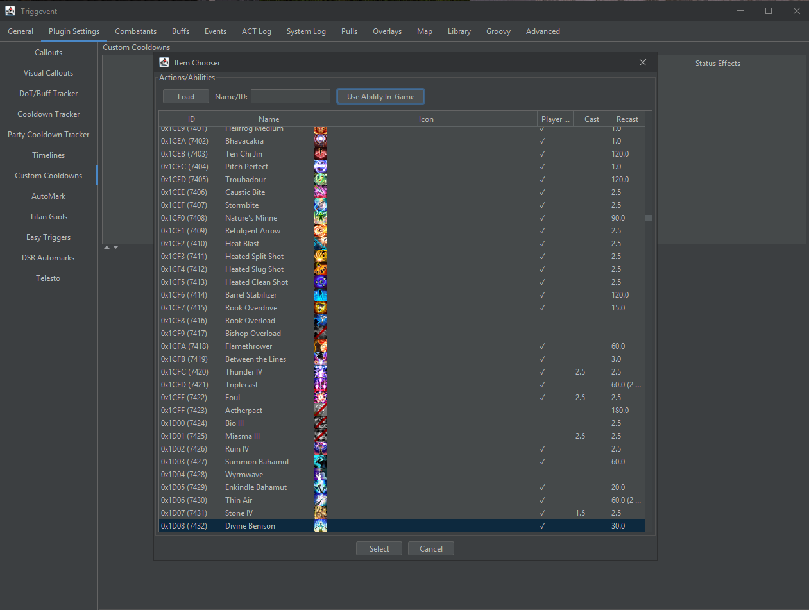
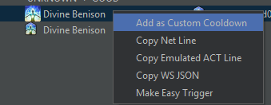
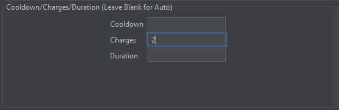

# Personal and Party CD Trackers

The "Cooldown Tracker" and "Party Cooldown Tracker" work identically, except that the Cooldown Tracker is only
for your own cooldowns. They can be configured separately.


## Instructions

Each cooldown has three columns:

- Overlay: Display the cooldown in the overlay
- TTS (Ready): Perform a TTS callout when the cooldown is about to be ready
- TTS (On Use): Perform a TTS callout when the cooldown is used

### TTS

As above, check the boxes for the cooldowns you'd like to receive calls for. You will also need to enable
the "Enable TTS" checkbox at the top. The "Time before expiry" field controls how soon you'd like the calls
(e.g. '5000' will result in the cooldown being called out when it is 5 seconds away from being ready).

### Overlay

"Enable Overlay" enables/disables the overlay. You should also check out the "Overlays" tab to change the locations,
size, and transparency of your overlays.

"Max in Overlay" controls the maximum number of Cooldowns to show in the overlay.

Cooldowns will show up in the overlay as follows:

- Ready: When it comes off cooldown, the text will say "Ready" and the bar will be green.
- Application Delay (buffs/debuffs only): When the cooldown is used, but the buff/debuff has not yet applied,
  the bar will be blue, and the text will be "..."
- Buff Active (buffs/debuffs only): When the buff is active, the bar will be blue, and the text will count down the
  remaining time on the buff.
- On cooldown: When the ability is on cooldown (and there is no buff active), the bar will be read, and the text will
  count down the time until it is ready again.

Note that the overlay does some magic so that "buff active" doesn't necessarily require a real buff, nor a buff with
the correct duration. This allows it to work for things like Living Shadow that don't place a buff. It also lets it
act as a Bard song tracker.

## Adding Custom Cooldowns

You now have the ability to add your own cooldowns in Plugin Settings > Custom Cooldowns. Any cooldowns added here
will appear in the UI for the personal and party cooldown tracker. This provides extensibility and flexibility similar
to Hojoring Special Spell Timers (SpeSpe) without the setup hassle.

First, you need to choose the ability to use as the cooldown. There are two ways to do this. For our example, let's use
Divine Benison.

The first way is to click the "New Cooldown" button. This will present you with a list of all known abilities, along
with a search box at the top. You can search by name (e.g. "Divine Benison") or by ID ("7432" or "0x1D08"). However, there
is alsoi a "Use Ability In-Game" button at the top. If you click this button, and then use the ability in-game, it will
be selected for you:



Click "Select" to finish.

Alternatively, if you have already used the ability, locate it on the Events tab, right click it, and select "Add as Custom Cooldown":



For most cooldowns, this is all you need to do. Cooldown, charges, duration, and buffs all come from game data and/or log lines, so
you don't need to manually enter anything else in the majority of situations. However, in this case, we need to tell Triggevent that
Divine Benison actually has two charges (since the second charge comes from a trait, and TE only knows about the base versions):



You can then configure it like any other cooldown, and have it display in overlays and/or perform TTS:


If a custom cooldown and a built-in cooldown have the same ability IDs, the custom cooldown definition
takes priority.

### Advanced

What about the rest of the fields?

* Name: Simply overrides the display name. The name is guessed based on the chosen abilities.
* Cooldown: The cooldown. Only needs to be overridden if a trait changes the cooldown.
* Charges: The number of charges. Only needs to be overridden if extra charges are granted by a trait.
  * Unfortunately, charge display is mutually exclusive with displaying the buff active time.
* Duration: Override the duration. 
  * For skills that place a buff, but the buff has the wrong duration (e.g. Bard songs), overriding the duration is all you need
    to do here.
  * For skills that do not place a buff (e.g. DRK's Living Shadow), you should also uncheck "Automatic" under status effects, and
    make sure the status effect list is empty.
* Secondary Abilities: Other abilities which share the same cooldown.
* Status Effects: Status effects that are placed by this ability. "Automatic" causes it to be derived from log lines.
  * If you want to disable active time display entirely for this cooldown, make the list empty, and uncheck "Automatic".
    You will need to do this to have an active duration display on abilities that do not place a buff (e.g. Living Shadow).

## For Devs

Cooldowns are defined in `xivdata/src/main/java/gg/xp/xivdata/data/Cooldown.java`

Going forward, it is recommended to use the builder. It will attempt to fill in information automatically from game data files and log lines.
You as the developer only need to fill in the parts that would be wrong according to those sources. For example, if a trait lowers the
cooldown or adds charges, you'll need to provide the max-level data.

At some point, it will be updated so that you don't even need the buff ID.

Here are some examples with explanations:

[//]: # (@formatter:off)
```java
// Simple cooldown, using the non-builder style. 
// Everything is automatic. You just specify the buff ID, the type, and whether or not 
// you want it to be in the personal CD overlay or not.
Holmgang(true,  CooldownType.INVULN, 0x2b),
        
// Simple cooldown, builder style
Oblation(builder(CooldownType.PARTY_MIT, false, 0x649A)),
        
// Overriding charge count - since the extra charge is granted by a trait, and the game files
// only list the values for the base skill, you need to provide this.
Plunge(builder(CooldownType.PERSONAL_BURST, true, 0xE38).maxCharges(2)),
        
// Multiple Ability IDs
AbyssalDrain(builder(CooldownType.PERSONAL_BURST, true, 0xE39, 0xE3B)),
        
// Overriding buff IDs. Since the 21/22-line doesn't convey the buff info correctly due to these
// being pet abilities, you need to specify the buff IDs manually
FeyIllumination(builder(CooldownType.PARTY_MIT, true, 0x409A).buffIds(0x13d, 0x753)),
        
// Cooldown changed by trait
DeploymentTactics(builder(CooldownType.PARTY_MIT, false, 0xE01).cooldown(90)),

// Overriding display name, since the default of "Phlegma/Phlegma II/Phlegma III" would be
// redundant.
Phlegma(builder(CooldownType.PERSONAL_BURST, true, 24313, 24307, 24289).name("Phlegma")),

// 'noAutoBuffs' disables the buff tracking aspect, since the 'Draw' buff isn't something 
// where we would care about the duration
Draw(builder(CooldownType.PARTY_BUFF, true, 0xE06).maxCharges(2).noAutoBuffs()),

// The second buff is not placed by the 21/22-line, so we need to specify buff IDs manually'
Horoscope(builder(CooldownType.HEAL,  false, 0x40AD).buffIds(0x762, 0x763)),

// Bard songs have a lot of jank, so we need to specify the buff ID and the duration
MagesBallad(builder(CooldownType.PARTY_BUFF, true, 0x72).buffIds(0x8a9).duration(45.0)),
ArmysPaeon(builder(CooldownType.PARTY_BUFF, true, 0x74).buffIds(0x8aa).duration(45.0)),
WanderersMinuet(builder(CooldownType.PARTY_BUFF, true, 0xde7).buffIds(0x8a8).duration(45.0)),

// Even if there is no buff at all, we can fake it using a duration (Living Shadow only
// shows duration on the job gauge, not a real buff).
LivingShadow(builder(CooldownType.PERSONAL_BURST, true, 0x4058).noAutoBuffs().duration(24)),


```
[//]: # (@formatter:on)

Note that 
