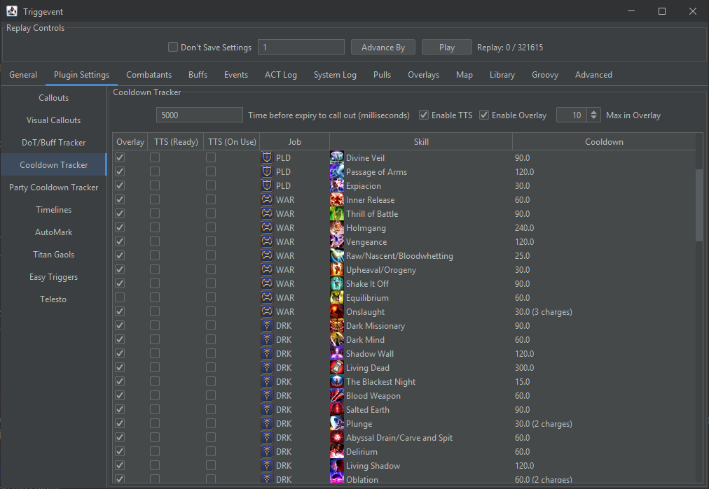

# Personal and Party CD Trackers

The "Cooldown Tracker" and "Party Cooldown Tracker" work identically, except that the Cooldown Tracker is only
for your own cooldowns. They can be configured separately.




## Instructions

Each cooldown has three columns:

- Overlay: Display the cooldown in the overlay
- TTS (Ready): Perform a TTS callout when the cooldown is about to be ready
- TTS (On Use): Perform a TTS callout when the cooldown is used

### TTS

As above, check the boxes for the cooldowns you'd like to receive calls for. You will also need to enable
the "Enable TTS" checkbox at the top. The "Time before expiry" field controls how soon you'd like the calls
(e.g. '5000' will result in the cooldown being called out when it is 5 seconds away from being ready).

### Overlay

"Enable Overlay" enables/disables the overlay. You should also check out the "Overlays" tab to change the locations,
size, and transparency of your overlays.

"Max in Overlay" controls the maximum number of Cooldowns to show in the overlay.

Cooldowns will show up in the overlay as follows:

- Ready: When it comes off cooldown, the text will say "Ready" and the bar will be green.
- Application Delay (buffs/debuffs only): When the cooldown is used, but the buff/debuff has not yet applied,
  the bar will be blue, and the text will be "..."
- Buff Active (buffs/debuffs only): When the buff is active, the bar will be blue, and the text will count down the
  remaining time on the buff.
- On cooldown: When the ability is on cooldown (and there is no buff active), the bar will be read, and the text will
  count down the time until it is ready again.


## For Devs

Cooldowns are defined in `xivdata/src/main/java/gg/xp/xivdata/data/Cooldown.java`

Going forward, it is recommended to use the builder. It will attempt to fill in information automatically from game data files.

At some point, it will be updated so that you don't even need the buff ID.

Here are some examples with explanations:

[//]: # (@formatter:off)
```java
// Simple cooldown, no buff
AbyssalDrain(builder(CooldownType.PERSONAL_BURST, true, 0xE39, 0xE3B)),
// Cooldown with associated buff
SaltedEarth(builder(CooldownType.PERSONAL_BURST, true, 0xE37).buffIds(0x2ed)),
// Cooldown with charge info - this is normally unnecessary, but plunge gets its extra charge from a trait, so we need to override it here.        
Plunge(builder(CooldownType.PERSONAL_BURST, true, 0xE38).maxCharges(2)),
// The same is true of cooldowns - if the trait reduces the CD, you need to override it
        
// Some buffs do not use their "real" duration (like Living Shadow and BRD songs), so you can override that        
LivingShadow(builder(CooldownType.PERSONAL_BURST, true, 0x4058).duration(24)),
```
[//]: # (@formatter:on)

