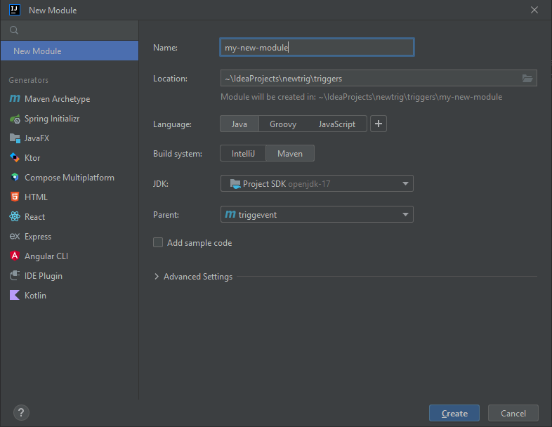
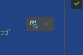
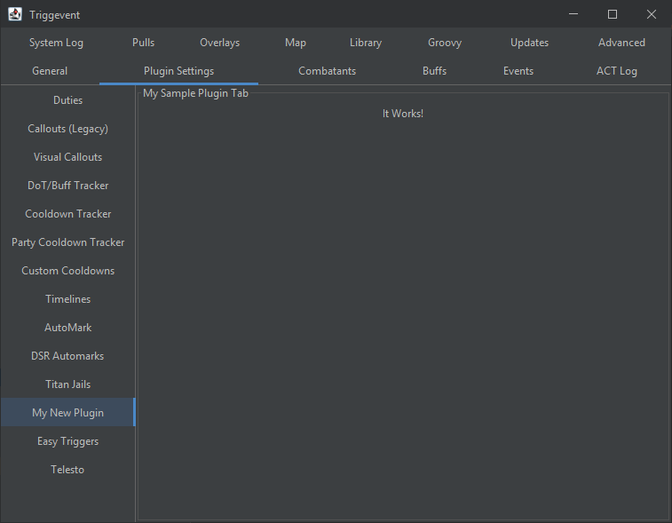
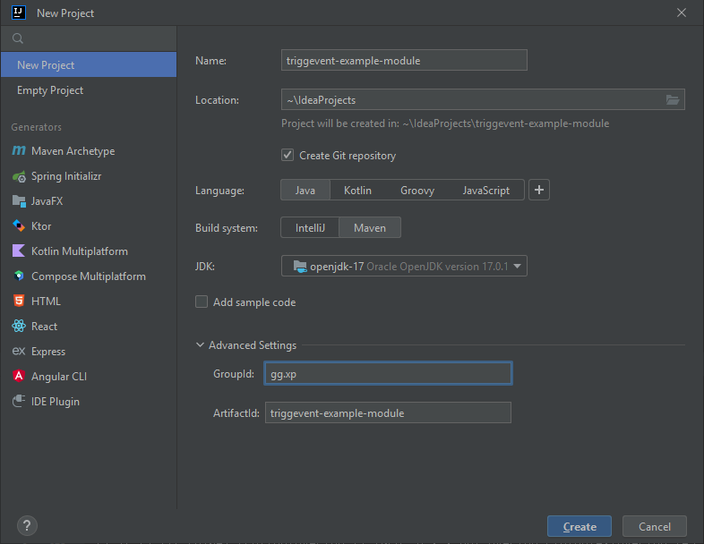
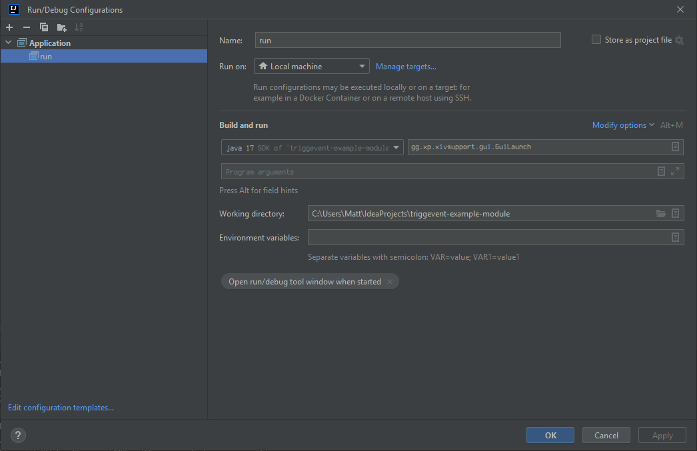
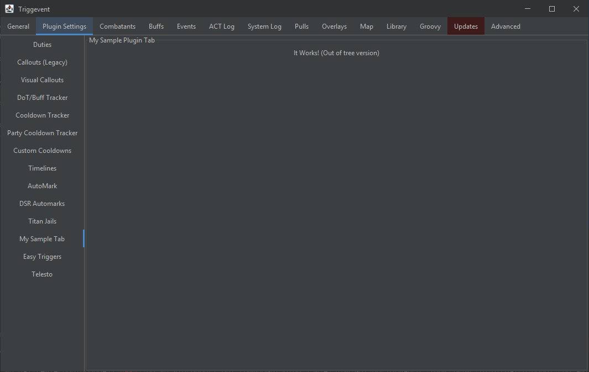
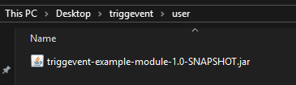

# Creating a Custom Module

Modules can be created in one of two ways: in-tree, or out-of-tree. In-tree is the way to go if you'd like to
have your module merged into the codebase. Out-of-tree is better if you'd like to keep it separate. In-tree means
breaking API changes will be handled for you, and your tests will be run as part of the main Triggevent build process,
meaning it is very unlikely an update will break your module. However, for more niche modules, you may wish to keep
them separate.

## In-Tree

There is an example of how to make an in-tree module in [this commit](https://github.com/xpdota/event-trigger/commit/1abf1d47794dbabdac1dc1f9960d74d9e289e549).

To make a new in-tree module, first, find an appropriate place in the directory structure for your module. Underneath the
'triggers' module is typically a good place (this is where the titan jail and other modules live).

To do so in IntelliJ, right click where you want to make your module, and select 'New > Module...'.
Make it look something like this:



Then, add it to the `<dependencyManagement>` section of the root pom.xml:

```xml

<dependencyManagement>
    <dependencies>
        <!-- Add yours at the bottom, after all the existing dependencies -->
        <dependency>
            <groupId>gg.xp</groupId>
            <artifactId>my-new-module</artifactId>
            <version>${project.version}</version>
        </dependency>
    </dependencies>
</dependencyManagement>
```

Next, add it as a concrete dependency to `launcher/pom.xml`:

```xml

<dependencies>
    <dependency>
        <groupId>gg.xp</groupId>
        <artifactId>my-new-module</artifactId>
    </dependency>
</dependencies>
```

Now, you're ready to start programming your module. However, to do anything useful, you'll want to pull in whichever dependencies
you need. `xivsupport` is the most common one, so add that to your module's `pom.xml` by creating a `<dependencies>` section. Your `pom.xml`
should look something like this (note that the parent/relativePath may be different depending on where you placed your new module):

```xml
<?xml version="1.0" encoding="UTF-8"?>
<project xmlns="http://maven.apache.org/POM/4.0.0"
         xmlns:xsi="http://www.w3.org/2001/XMLSchema-instance"
         xsi:schemaLocation="http://maven.apache.org/POM/4.0.0 http://maven.apache.org/xsd/maven-4.0.0.xsd">
    <parent>
        <artifactId>triggevent</artifactId>
        <groupId>gg.xp</groupId>
        <version>1.0-SNAPSHOT</version>
        <relativePath>../../pom.xml</relativePath>
    </parent>
    <modelVersion>4.0.0</modelVersion>

    <artifactId>my-new-module</artifactId>

    <dependencies>
        <dependency>
            <groupId>gg.xp</groupId>
            <artifactId>xivsupport</artifactId>
        </dependency>
    </dependencies>

</project>
```

After you have made changes to any pom file, use the 'reimport pom' button in the top-right of the editor to reload the changes:



Now, you can write your code. In your new module directory, under src/main/java, create a new package, and give it a name (in reverse URL format,
e.g. foo.bar.com would become com.bar.foo). Then, create a new Java class within there (let's call it 'MySampleTab.java'), and put these contents in it:

```java
package com.bar.foo;

import gg.xp.reevent.scan.ScanMe;
import gg.xp.xivsupport.gui.TitleBorderFullsizePanel;
import gg.xp.xivsupport.gui.extra.PluginTab;

import javax.swing.*;
import java.awt.*;

@ScanMe
public class MySampleTab implements PluginTab {
	@Override
	public String getTabName() {
		return "My New Plugin";
	}

	@Override
	public Component getTabContents() {
		TitleBorderFullsizePanel panel = new TitleBorderFullsizePanel("My Sample Plugin Tab");
		panel.add(new JLabel("It Works!"));
		return panel;
	}
}
```

Now, if you run `launcher/src/main/java/gg/xp/xivsupport/gui/GuiLaunch` (Right Click > Run), you should see your new tab:



To build the packaged executables, open the 'maven' panel, and under triggevent > Lifecycle, first run 'clean', then 'install' (double-click to run).
The built files will be in `launcher/target/windows`. DO NOT accept the update, or your custom build will be overwritten with the standard installation.

## Out-of-Tree

The out-of-tree instructions are mostly the same, except the module will live outside of Triggevent's directory structure.

There is an [example project](https://github.com/xpdota/triggevent-example-module) that you can use as a template instead of following the instructions to create it from scratch.

First, check out the main Triggevent project. Do the same clean/install process as above to install the modules into your local maven repository.

Then, create a new project, it should look something like this:



As with the in-tree instructions, add the dependencies. Edit the pom to use 'triggevent' as its parent. As with the in-tree instructions, you'll need
to add some dependencies, most likely the 'xivsupport' module. You'll also want to add 'launcher' as a dependency so that you can run/debug without
having to do a full build. your pom should look something like this:

```xml
<?xml version="1.0" encoding="UTF-8"?>
<project xmlns="http://maven.apache.org/POM/4.0.0"
         xmlns:xsi="http://www.w3.org/2001/XMLSchema-instance"
         xsi:schemaLocation="http://maven.apache.org/POM/4.0.0 http://maven.apache.org/xsd/maven-4.0.0.xsd">
    <modelVersion>4.0.0</modelVersion>

    <artifactId>triggevent-example-module</artifactId>
    <version>1.0-SNAPSHOT</version>

    <parent>
        <artifactId>triggevent</artifactId>
        <groupId>gg.xp</groupId>
        <version>1.0-SNAPSHOT</version>
    </parent>

    <dependencies>
        <dependency>
            <groupId>gg.xp</groupId>
            <artifactId>xivsupport</artifactId>
        </dependency>
        <dependency>
            <groupId>gg.xp</groupId>
            <artifactId>launcher</artifactId>
            <version>${project.version}</version>
        </dependency>
    </dependencies>

</project>
```

Similar to the in-tree version, let's start by creating the 'com.bar.foo' package, and create a very simple plugin tab in it:

```java
package com.bar.foo;

import gg.xp.reevent.scan.ScanMe;
import gg.xp.xivsupport.gui.TitleBorderFullsizePanel;
import gg.xp.xivsupport.gui.extra.PluginTab;

import javax.swing.*;
import java.awt.*;

@ScanMe
public class MySampleTabOutOfTree implements PluginTab {
	@Override
	public String getTabName() {
		return "My Sample Tab";
	}

	@Override
	public Component getTabContents() {
		TitleBorderFullsizePanel panel = new TitleBorderFullsizePanel("My Sample Plugin Tab");
		panel.add(new JLabel("It Works! (Out of tree version)"));
		return panel;
	}
}
```

Then, create a run configuration that looks like this (the 'Main Class' is the important part):



Hit run, and you should see your new tab in the UI:



Now, to actually package it, do a clean/install on your module, then find the resulting jar in the 'target' directory.
To actually install it, find your normal Triggevent install directory, and place the jar in a directory called 'user'
(create it if it doesn't exist):



Then, run Triggevent.exe as usual, and you should see your new plugin tab.