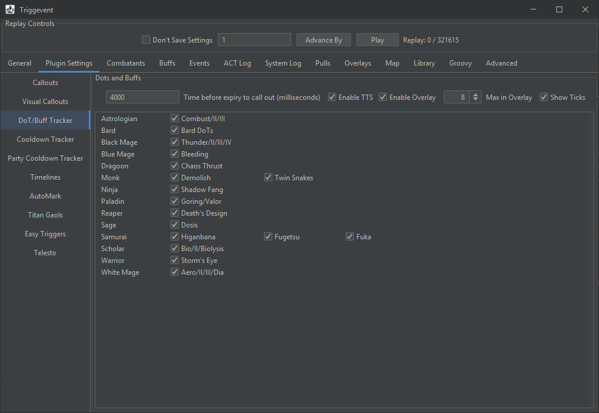

# Multi-Target DoT Tracker

## Instructions

First, select the DoTs you want to track.

Note that there are a few non-DoTs in here too. These include RPR's debuff, and Samurai's personal buffs.

### TTS

"Enable TTS" enables/disables the TTS callouts. "Time before expiry" controls how soon you'd like the DoT called out. 
e.g., for a 30 second DoT, a value of 5000 will cause it to be called out in 25 seconds (5 seconds before expiring).

### Overlay

"Enable Overlay" enables/disables the overlay. You should also check out the "Overlays" tab to change the locations,
size, and transparency of your overlays.

"Max in Overlay" controls the maximum number of DoTs to show in the overlay.

"Show Ticks" controls whether or not to show the tick marks indicating when the DoT will actually tick.

### Combining Targets

The overlay will attempt to combine multiple targets with the same buff and remaining duration:

## For Devs

DoTs are defined in `xivdata/src/main/java/gg/xp/xivdata/data/DotBuff.java`

The only information needed is what class it applies to, a display name, and the buff ID. 