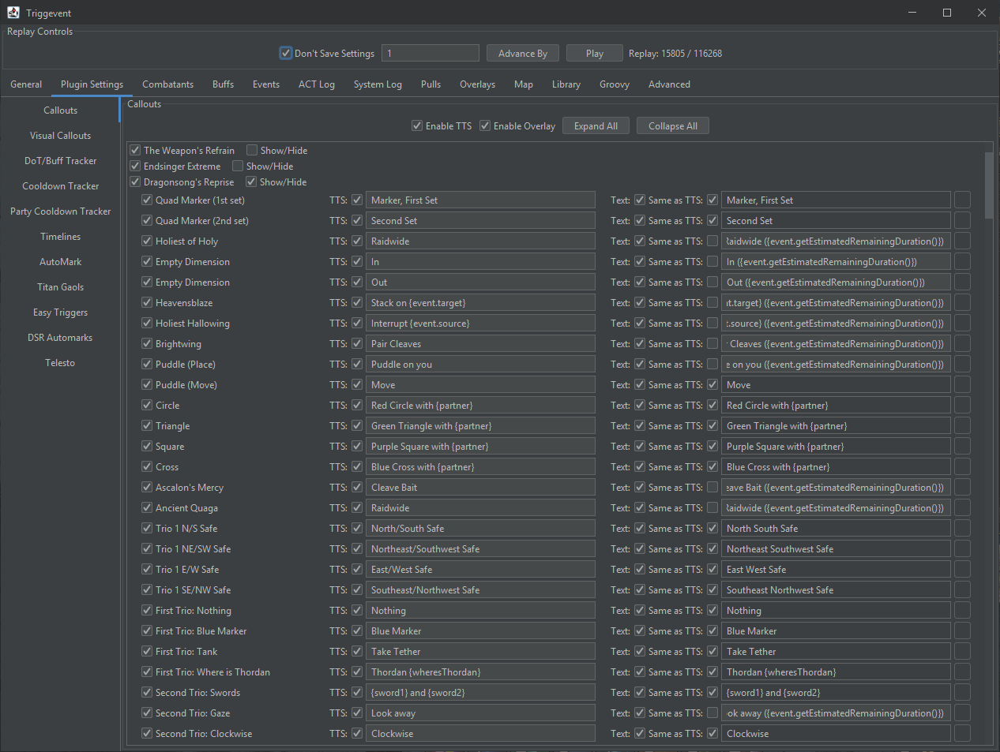
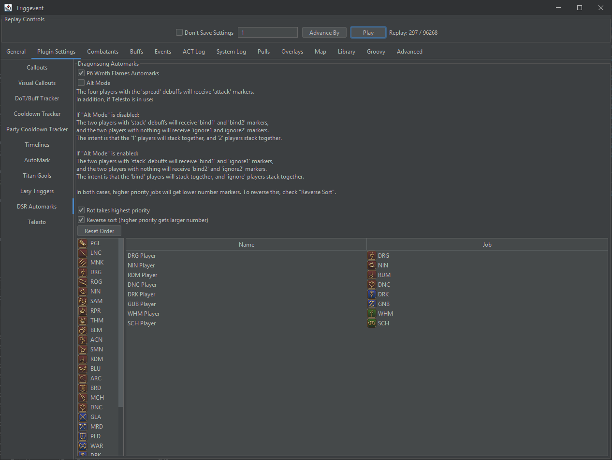
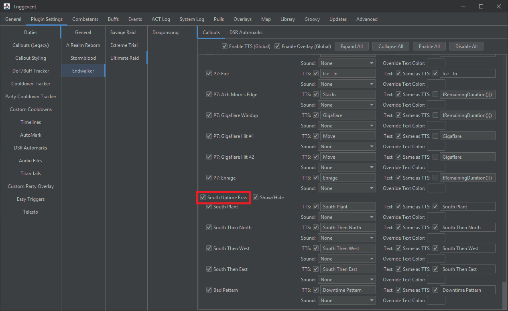

# Dragonsong War

Triggevent has a complete set of triggers for Dragonsong War (Ultimate), also known as DSR or Dragonsong's Reprise.
This collection includes triggers for all phases, as well as Wroth Flames automarks and a Haurchfaunt HP tracker.

You can find these in Plugin Settings > Callouts:

As with everything in Triggevent, you can change each callout text freely to customize it to your strategies.

## P1: Door Boss

Nothing out of the ordinary here. Most triggers should be fairly self explanatory.

## P2: Thordan

You should be aware that for the second trio, by default the rotation direction will be for the strategy where
one group goes towards the knight, and one away. For the fixed west/east strategy, you will need to reverse the
callouts.

To have it call "Swap" or "No Swap" for the swords rather than simply calling who has them, change the callout to
something like this:

`{(sword2.isThePlayer() || sword1.job.name() == 'WHM') ? "Swap!" : "No Swap!"}`

Replace 'WHM' with the abbreviation of the job that you would be swapping with. If you are normally group 2,
switch sword2 and sword1 around.

## P3: Nidhogg

The wyrmhole callouts assume that you are using the typical strategy where 1s and 3s drop towers west, south, and east, while
2s drop towers NW and NE. In theory, it should also work if you flipped vertically or rotated it 180 degrees, but if you are
doing any other orientation, the callouts may be wrong (specifically, determining if you are middle 1 or side 1).

## P4: Eyes

The tether callout indicates which tether you *have* rather than which tether you *need*.

## Intermission: Save Him!

There is a weak aura with Haurchefants HP (including shields). To disable it, simply uncheck the "Haurchefant HP bar" callout.

## P5: Thordan Again

Nothing out of the ordinary. You'll likely want to customize the PS marker callouts to your own strategy (they can be different from P1).

## P6: Dragons

There is a weak aura that appears while Akh Morn is casting that shows which has higher HP if one of them is too high.

There is also an automarker for Wroth Flames (both the stacking flame and spreading flame portions). 
To enable it, go to Plugin Settings > DSR Automarks. Configuring the automarks
works the same as UWU - see [Titan Jails](Titan-Jail.md). There are some additional settings specific to Wroth:

The first checkbox, "P6 Wroth Flames Automarks", enables/disables the whole thing. 

Note that Telesto is required for the stack markers. With plain macros, only the four spread markers are supported.

"Alt Mode" switches between one of two modes for how to mark the stack pairs. Alt Mode ON gives the people with the stack 
debuff bind1 and ignore1, and the two people with nothing receive bind2 and ignore2. The idea is that the two 'bind' markers
will stack, and the two 'ignore' markers will stack. With Alt Mode OFF, the people with the stack debuff receive bind1 and bind2,
while the people with nothing receive ignore1 and ignore2. The two #1s should stack, and the two #2s should stack.

The rest of this screen controls the priority system. The list of jobs controls the priority for who gets lower/higher numbers, and
the "Rot takes highest priority" makes the player who currently has rot the highest priority. You should arrange the list so that the
person *receiving* rot next is at the top. The "reverse sort" option causes higher priority to receive a higher number, while
unchecking this option causes the higher priority players to receive a lower number.

While there is not a specific test macro like the titan gaol automarkers, you can still use the 'amtest' command (e.g. `/e c:amtest 1` will
mark yourself if macros or Telesto are working). However, you can test it by importing a log file using the 
[same instructions as Titan Gaols](Titan-Jail.md#testing-with-a-log-file).

## P7: Dragon-King Thordan

Most triggers are self-explanatory.

### Uptime Exaflares

You will need to enable the callouts here - they are disabled by default:

While you're at it, you'll probably want to disable the normal exaflare callout.

This strat gives you four or five possible movements:

1. South Plant: Dodge into the south exaflare, then plant (both the NW and NE exaflares will miss you). 
2. South then North: Dodge into the south exaflare, then move towards the north of the hitbox (both the NW and NE exaflares will hit south).
3. South then West: Dodge into the south exaflare, then stand at the SW side of the hitbox (to dodge NW exaflare).
4. South then East: Dodge into the south exaflare, then stand at the SE side of the hitbox (to dodge NE exaflare).
5. Downtime: Dodge into south, then dodge outwards. Unconfirmed if this pattern can actually happen.

[This video](https://www.youtube.com/watch?v=CglVBeTfEec) shows the 'plant' and 'side' patterns, but does not show the "South then North" spot.

You will likely want to disable the "P7: Exaflare Windup" callout so that it doesn't talk over the uptime callout.