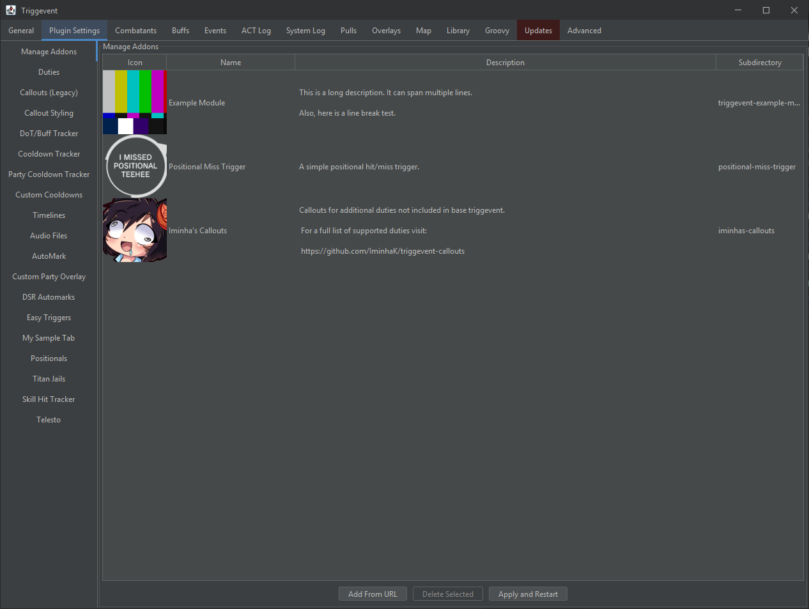

# Plugins

To install or remove plugins, navigate to Plugin Settings > Manage Addons:

## Creating a Plugin

See [Custom Module](/pages/Custom-Module.md#out-of-tree) and [Example Module](https://github.com/xpdota/triggevent-example-module) for more information.

The example module project contains everything necessary to build and distribute a plugin (except Triggevent itself), including GitHub actions scripts
to build and publish it on github-pages.

# Featured Plugins

- [Positional Miss Trigger](https://github.com/xpdota/positional-miss-trigger) - Positional Miss trigger
- [Autoattack Swing/MP Tick Timer](https://github.com/xpdota/triggevent-aa-tick-timer) - Autoattack and MP tick timer overlay
- [Iminha's Callouts](https://github.com/IminhaK/triggevent-callouts) - Callouts for some duties which are not natively supported.
- [Iminha's Automarkers](https://github.com/IminhaK/triggevent-auto-markers) - Additional Automarkers for P8S