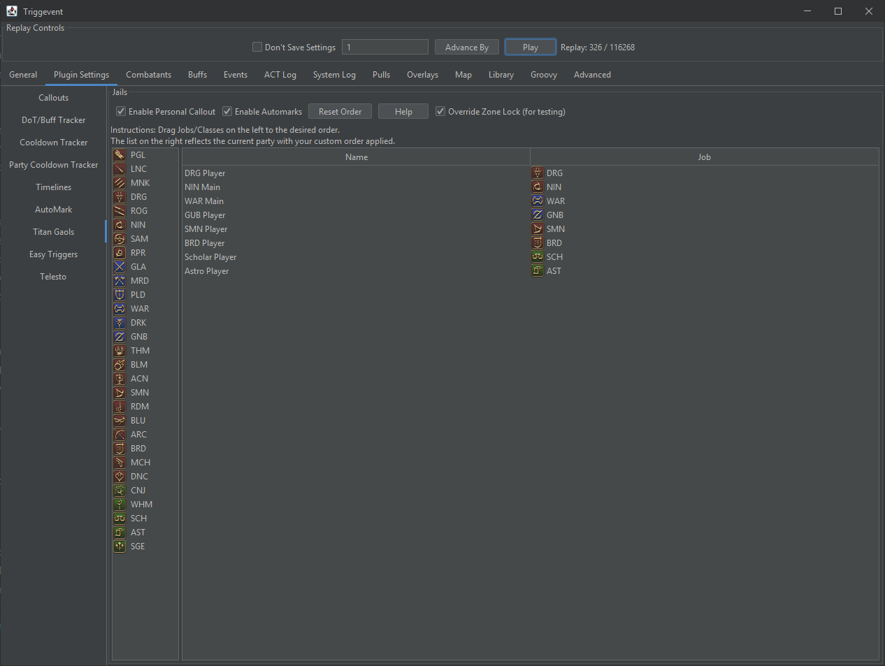

# How Triggevent is Different

Now that we've talked about the [issues with existing solutions](/pages/The-Problems-with-Existing-Solutions.md), let's talk more about
how Triggevent is different.

## What is the 'Job' of a Trigger?

What this all really boils down to is: what is the responsibility of the trigger, and what is the responsibility of the framework in which
the trigger is made? Triggevent takes the approach that the former should be "only the parts that are absolutely unique to that trigger", and
that all the boilerplate should be external.

Cactbot is very good at this - the vast majority of it is abstracted. The trigger definition doesn't need to care about the exact format of the log
line, nor how to provide user customization of the TTS/text, nor how to display it on the screen. Triggevent takes it a step further. For example,
you'll notice many Cactbot triggers define the source as a name of a boss. This requires auto-translation to support other languages, and isn't
perfect - for example, often times, a boss and several fake actors will share the same name. Triggevent, with its fully parsed objects, provides a
lot more than what is just on the log line. NPC and NPC name IDs, action effect parsing, type conversion, injection of data from other sources
(e.g. OverlayPlugin or Telesto), and much more. You can even get details that come from in-game data files, like ability recast times.

Let's look at some of the abilities that Triggevent has.

## Customization

By using the 'ModifiableCallout' class to build callouts, and annotating the class with @CalloutRepo, the callouts automatically show up in the
Plugins > Callouts tab, allowing the user to enable/disable them, modify the TTS, and change the on-screen text.

```java

@CalloutRepo("Dragonsong's Reprise")
public class Dragonsong {

	private final ModifiableCallout<HeadMarkerEvent> p1_firstCleaveMarker = new ModifiableCallout<>("Quad Marker (1st set)", "Marker, First Set");
	private final ModifiableCallout<HeadMarkerEvent> p1_secondCleaveMarker = new ModifiableCallout<>("Quad Marker (2nd set)", "Second Set");
	private final ModifiableCallout<AbilityCastStart> p1_holiestOfHoly = ModifiableCallout.durationBasedCall("Holiest of Holy", "Raidwide");
	private final ModifiableCallout<AbilityCastStart> p1_emptyDimension = ModifiableCallout.durationBasedCall("Empty Dimension", "In");
	private final ModifiableCallout<AbilityCastStart> p1_fullDimension = ModifiableCallout.durationBasedCall("Empty Dimension", "Out");
	private final ModifiableCallout<AbilityCastStart> p1_heavensblaze = ModifiableCallout.durationBasedCall("Heavensblaze", "Stack on {event.target}");
	private final ModifiableCallout<AbilityCastStart> p1_holiestHallowing = ModifiableCallout.durationBasedCall("Holiest Hallowing", "Interrupt {event.source}");
	private final ModifiableCallout<BuffApplied> p1_brightwing = ModifiableCallout.durationBasedCall("Brightwing", "Pair Cleaves");

    ...
}
```

This shows up on the UI like this:


However, sometimes, that's not enough. In the event that a plugin legitimately needs more customization (e.g. a priority list), it can define
its own customization UI:



## Game Data Files

In fact, let's look at the example of cooldown tracking. Let's say we want a simple CD tracker that also shows the buff's active duration. You'd
think that you'd need to record the ability ID, cooldown, buff ID, and duration, right? Nope. The cooldown is in the data files for actions
(with the exception being when a trait lowers the cooldown), the buff ID is in the 21-line, and the duration is in the 26-line. This data is all
easily accessible in Triggevent. Even the icons are accessible. This means that for most cooldowns, you would need *only* the ability ID, and
everything else can be derived!

## State Repositories

Let's take an example of a mechanic that places different buffs on different players (or places one buff but only on certain players), and then
later those buffs come back into play when the boss starts casting a particular ability.

Normally, you would need one trigger to collect the buffs and store them somewhere. The second trigger would then reference wherever they were
stored, and figure out what should be called.

In Triggevent, the former becomes unnecessary, because you can just query various state objects (buffs, castbars, etc):

[//]: # (@formatter:off)
```java
if (getBuffs().statusesOnTarget(getState().getPlayer()).stream().anyMatch(buff -> buff.getBuff().getId() == 0xB11)) {
    s.accept(thordan2_trio1_inLightning.getModified(donut));
}
else{
    s.accept(thordan2_trio1_in.getModified(donut));
}
```
[//]: # (@formatter:on)

This example is for Wrath of the Heavens, when the dynamo happens. If you have lightning, it will call "in with lightning", and if you don't, it just calls "in".

## Sequential Triggers

Many mechanics consist of complex sequences of events. These can be a mess to make triggers for, because there's no way to read them that
provides a nice overview of the actual flow and logic. Here's the full Wrath of the Heavens example:

[//]: # (@formatter:off)
```java
    @AutoFeed
    private final SequentialTrigger<BaseEvent> thordan2_trio1 = new SequentialTrigger<>(30_000, BaseEvent.class,
            // Start this sequential trigger on the actual Wrath of the Heavens cast
            event -> event instanceof AbilityUsedEvent aue && aue.getAbility().getId() == 0x6B89,
            (e1, s) -> {
                // The first thing that happens is the two tethers
                List<TetherEvent> tethers = s.waitEvents(2, TetherEvent.class, tether -> tether.getId() == 5);
                // next, the blue marker
                HeadMarkerEvent blueMark = s.waitEvent(HeadMarkerEvent.class);
                // Give a different callout depending on whether the player is blue marker, tether, or nothing
                if (blueMark.getTarget().isThePlayer()) {
                    s.accept(thordan2_trio1_blueMark.getModified(blueMark));
                }
                else {
                    Optional<TetherEvent> tetherOnPlayer = tethers.stream()
                            // A neat part of TetherEvent is that we have a method to test if *either* target matches
                            // some condition, so we don't have to worry about whether the player is the first or
                            // second target.
                            .filter(tether -> tether.eitherTargetMatches(XivCombatant::isThePlayer))
                            .findAny();
                    if (tetherOnPlayer.isPresent()) {G
                        s.accept(thordan2_trio1_tether.getModified(tetherOnPlayer.get()));
                    }
                    else {
                        s.accept(thordan2_trio1_neither.getModified());
                    }
                }

                // Green marker
                HeadMarkerEvent greenMark = s.waitEvent(HeadMarkerEvent.class);
                // Only call if green is on the player
                if (greenMark.getTarget().isThePlayer()) {
                    s.accept(thordan2_trio1_greenMark.getModified(greenMark));
                }
                // Call out the 'spread'
                AbilityCastStart spread = s.waitEvent(AbilityCastStart.class, acs -> acs.getAbility().getId() == 0x63CA);
                s.accept(thordan2_trio1_protean.getModified(spread));

                // Now, call out the dynamo, BUT modify the call based on whether the player has lightning or not.
                AbilityCastStart donut = s.waitEvent(AbilityCastStart.class, acs -> acs.getAbility().getId() == 0x62DA);
                if (getBuffs().statusesOnTarget(getState().getPlayer()).stream().anyMatch(buff -> buff.getBuff().getId() == 0xB11)) {
                    s.accept(thordan2_trio1_inLightning.getModified(donut));
                }
                else {
                    s.accept(thordan2_trio1_in.getModified(donut));
                }

            }

    );
```
[//]: # (@formatter:on)

That's it. That's the entirety of Wrath of the Heavens, minus twisters and liquid heaven. See the comments in the code for more detail.

After hitting the start point (in this case, the literal 'Wrath of the Heavens' cast), the trigger executes its code.
When it hits a 's.waitEvent' call, think of it like `await` - it will 'pause' the code until it sees that event.

### Updating Existing Calls

While this is doable manually, a neat feature of Sequential Triggers is the ability to 'update' a call. If you are calling out multiple things in sequence, you
can do it in several ways depending on the circumstances:

- Just do multiple calls (each will have their own TTS and on-screen text)
- Make use of the dynamic nature of on-screen text to update the call as you go (example: meteor drops in DSR). This does NOT result in multiple TTS calls.
- Update an existing call, resulting in a new TTS call, but updates the text on screen in-place.

The third can be done manually like so. This trigger calls out when you swap the red/blue tether in DSR eye phase:

[//]: # (@formatter:off)
```java
	private CalloutEvent previousRedBlueCall;

	@HandleEvents
	public void doRedBlueTethers(EventContext ctx, BuffApplied ba) {
		if (ba.getTarget().isThePlayer()) {
			CalloutEvent call;
			long id = ba.getBuff().getId();
			if (id == 0xAD7) {
				call = redTether.getModified(ba);
			}
			else if (id == 0xAD8) {
				call = blueTether.getModified(ba);
			}
			else {
				return;
			}
			if (previousRedBlueCall != null) {
				// This is the secret sauce - we tell the new call that it should completely replace the old one
				call.setReplaces(previousRedBlueCall);
			}
			ctx.accept(call);
			previousRedBlueCall = call;
		}
	}
```
[//]: # (@formatter:on)

However, sequential triggers have an even more slick way of handling this, as we see in the Skyblind trigger:

[//]: # (@formatter:off)
```java
	private final ModifiableCallout<BuffApplied> p1_puddleBait = ModifiableCallout.<BuffApplied>durationBasedCall("Puddle (Place)", "Puddle on you").autoIcon();
	private final ModifiableCallout<BuffRemoved> p1_puddleBaitAfter = new ModifiableCallout<BuffRemoved>("Puddle (Move)", "Move").autoIcon();

	@AutoFeed
	private final SequentialTrigger<BaseEvent> p1_puddleBaitSeq = new SequentialTrigger<>(10_000, BaseEvent.class,
			e -> e instanceof BuffApplied ba && ba.getBuff().getId() == 0xA65 && ba.getTarget().isThePlayer(),
			(e1, s) -> {
				s.updateCall(p1_puddleBait.getModified((BuffApplied) e1));
				BuffRemoved removed = s.waitEvent(BuffRemoved.class, br -> br.getBuff().getId() == 0xA65 && br.getTarget().isThePlayer());
				s.updateCall(p1_puddleBaitAfter.getModified(removed));
			});

```
[//]: # (@formatter:on)

Here, we initially set it to the "Puddle on you" call - but once the debuff expires, we change the call to "Move". The on-screen text updates in place,
but we get a new TTS.

## Log Analysis

One of the main advantages is Triggevent is the 'Events' UI is incredibly powerful. This gives you a very good amount of information and tells you what each
log line *actually means*, in human-readable form. One of the difficulties of making triggers currently is that looking through a log file could be a little
easier. So, there's a great visualization of everything going on:


You can also use the 'Combatants' tab and the 'Map' tab to see a detailed view of the state of combatants and what all is going on:


# Multiple Data Sources

We've already seen that we can use various data sources for replays, such as ACT log files, Triggevent's own save format, or fflogs. But the same is true of
live runs as well. In its current form, combatants and party data come from ACT lines, OverlayPlugin, and Telesto. Available data sources are merged together
seamlessly behind the scenes. Neither the trigger maker nor the user has to worry about it. For example, combatant positions come from ACT log lines and
OverlayPlugin, with the most recent being preferred. HP, on the other hand, will use ACT lines and OverlayPlugin data, but HP from 37/38/39 lines takes
priority due to it being the most up to date (as it comes from network data rather than memory). 

In the future, the resilience of the application against game updates could be massively improved by implementing a Dalamud plugin that feeds it similar
combat data, roughly equivalent to ACT lines. Since it all gets abstracted away, a trigger or overlay would have no idea that there's no ACT under the hood!
This means that, on the rare occasion such as 6.15 where Dalamud plugins are updated faster than the ACT parsing plugin, your overlays and triggers would be
up and running a lot sooner.

# Hold It - I'm not a Programmer!

You got me - almost. Most of what I've talked about so far has been regarding triggers written in code. Triggernometry, however, lets you make them
with a visual editor. Triggevent currently has 'Easy Triggers', and I plan to significantly expand this functionality.


Right now, easy triggers are fairly basic, but they demonstrate the concept. Compared to Triggernometry, it tries to round off some of the edges and help you
avoid some pitfalls. It gives you a UI to pick ability/status IDs, and tries to never even give you the option of doing something invalid. 

But it doesn't stop there. The biggest strength of Easy Triggers is the fact that in many cases, one can be **automatically created from an event**:


*That's* the true strength - doing the whole thing for you!

# Conclusion

Is Triggevent perfect in any way? No. Is it complete? Absolutely not, I add new features left and right. 
This was supposed to be a proof of concept, but I realized that there were some serious UX needs that weren't being filled by anything,
despite a decent amount of competition in the space.
Do I think everyone should immediately drop everything else and switch to it? No.
But if there's one takeaway that I want you to get from this, it's simple: now that we've seen what is *possible*, let's do better. 
I would love nothing more than to have another program come along and do everything better.