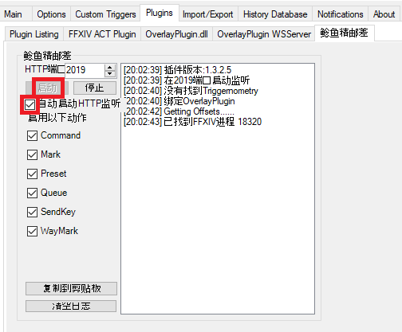
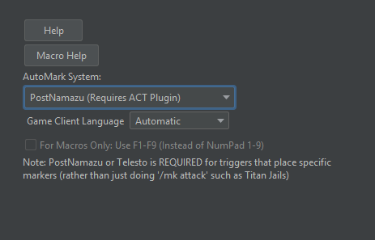

# PostNamazu Support

[PostNamazu](https://github.com/Natsukage/PostNamazu) is an ACT plugin that provides the ability to mark players and send commands
to the game. Full support is still being built out, but the marker functionality is working.

## Markers

What makes PostNamazu superior to other current marker options is that it can mark by entity ID. This provides two main advantages:
More reliability due to not being reliant on a correctly-sorted party list, and the ability to mark things other than party members.

There are also smaller benefits, like not needing translation logic for different game client languages.

Currently, it supports marking players, even if they are outside the party. In time, I will extend the abstraction to also support
marking NPCs once I figure out certain safety issues (e.g. it should not allow you to mark something untargetable). 

### Known Issues

PostNamazu does not natively support the notion of clearing whatever marker is on a specific entity. When you issue a command
like `/mk clear <me>`, what the game actually does is check what marker is currently on the specified entity, and then re-assigns
that marker to an invisible entity. This means we need to track what marker is currently on which unit so that we can do the
equivalent. The caveat is that Triggevent does not know about markers placed prior to launch - so there is a small chance of
issues if you do not launch Triggevent prior to manually placing markers (e.g. marking healers/tanks/safety triangle). 

## Commands

The PnGameCommand event class allows for commands to be sent to the game. It works exactly the same as `TelestoGameCommand`.

# Setup

1. Install PostNamazu like any other ACT plugin
   - In the ACT main window, navigate to Plugins > Plugin Listing
   - Click "Browse..." and find the PostNamazu.dll file you downloaded
   - Click "Add/Enable Plugin"
2. Navigate to the new tab
3. Click the "Start" button, and check the auto-start checkbox, highlighted in red boxes:

4. In Triggevent, in Plugins Settings > PostNamazu, click the "Test" button and make sure it works 
    (the game will need to be running and you will need to be logged in to your character)
5. Under the AutoMark tab, switch to PostNamazu:

6. In game, run `/e c:samtest bind1 1` and make sure that the Chain 1 marker appeared on yourself.