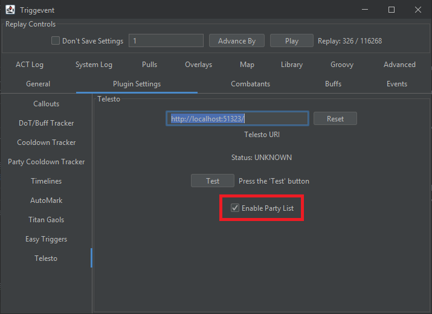
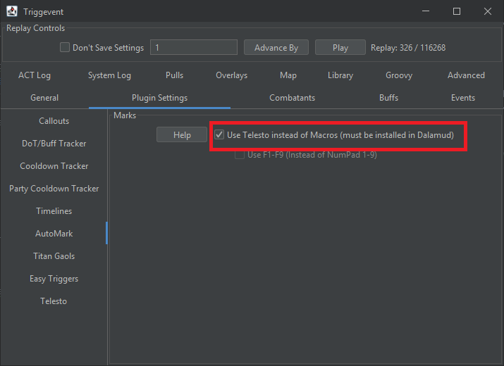

# Telesto Support

[Telesto](https://github.com/paissaheavyindustries/Telesto) is a Dalamud plugin that allows certain commands to be sent directly 
to the game, with the obvious and most common use case being 
the ability to use automarkers without setting up macros. It also supports pulling the party list from the game directly,
which is great because ACT (and by extension, both Triggernometry and OverlayPlugin) doesn't tell us the *order* of the party list.
In addition, Triggernometry also used to have some party list bugs on top of that.

This has been the source of many automark issues - someone has their Triggernometry party list set up differently than their
in-game sorting, and the mismatch causes the wrong people to be marked. In theory, Telesto fixes this for Triggernometry.

However, in Triggernometry, there's no direct integration between the two. It is entirely on the trigger dev to rewrite their trigger
to use Telesto's party list instead. Same with markers - it's on the dev to do that.

So how can this be done better?

## Party List

Triggevent has seamless integration of Telesto's party list.

### As an End User

In order to make use of Telesto's party list as an end user, all you need to do is:

- Install Telesto
- Check this box:



- If you need to change the port or host, change the URL (99% of you can ignore this)

There's even a "Test" button to make sure Telesto is working.

### As a Trigger Developer

In order to make use of Telesto's party list as a dev, all you need to do is:
- Literally nothing

Seriously. Nothing. If Telesto support is enabled, and Triggevent can pull the party list, it will attempt to do so automatically 
when it detects a party change, zone change, or a few other events. That party list overrides the one from ACT or OverlayPlugin. 

## Automarks

### As an End User

To use Telesto-based automarks, after installing Telesto (and changing the URL if needed), all you need to do is check this box:



Then, *any* trigger using the existing automarks will automatically use this instead.

#### Making Your Own Automarkers

For simple Automarkers, you can easily make them in the UI, by using [Easy Triggers](/pages/tutorials/Easy-Triggers.md).
This will be sufficient for anything where the markers should be placed on anyone affected by a particular ability or debuff
(such as Titan Gaols or DSR/UCoB Thunderstruck), though you won't be able to set up a priority system. 

Here is an example:


### As a Trigger Developer

Once again, as a developer, you change literally nothing about how you do the basic automarks. The only part that changes is
that Telesto enables you to use specific marks rather than sequential attack markers via the SpecificAutoMarkRequest event:
```java
// Basic 'attack' marker, same as before - this works fine with both Telesto and Macros:
context.accept(new AutoMarkRequest(target));
// Equivalent of above, in the new format:
context.accept(new SpecificAutoMarkRequest(target, MarkerSign.ATTACK_NEXT));
// Use the next available 'bind' marker:
context.accept(new SpecificAutoMarkRequest(target, MarkerSign.BIND_NEXT));
// Use the #2 ignore/stop marker:
context.accept(new SpecificAutoMarkRequest(target, MarkerSign.IGNORE_2));
// The square marker:
context.accept(new SpecificAutoMarkRequest(target, MarkerSign.SQUARE));
```

## Other Game Commands

### As an End User

Once again, just install Telesto.

### As a Trigger Developer

Example:

```java
context.accept(new TelestoGameCommand("/echo Here's some text to echo"));
```

(Or eventMaster.pushEvent as appropriate).