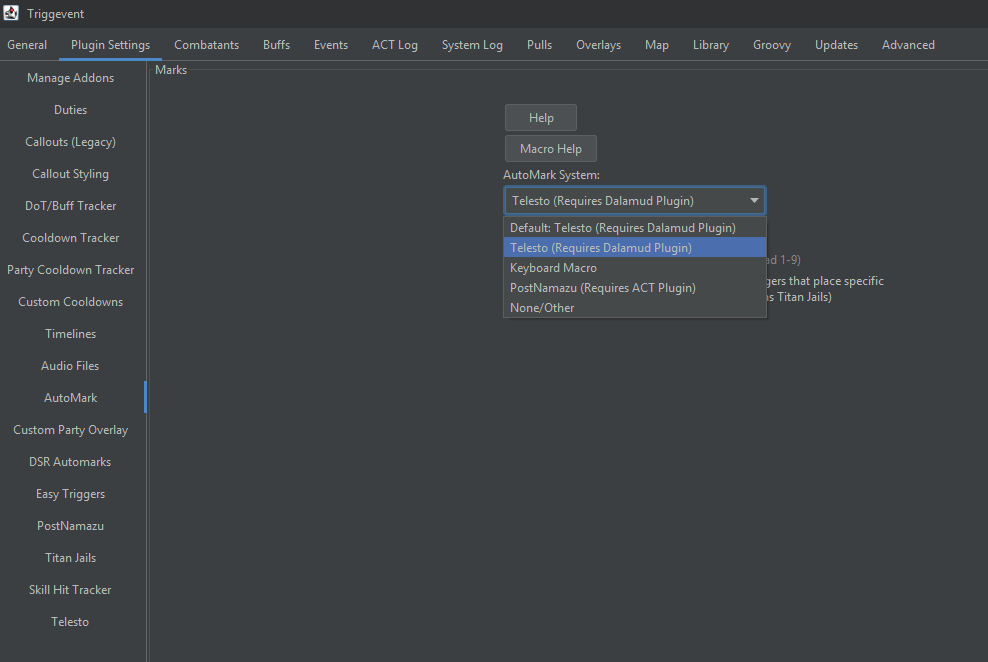

# Telesto Support

[Telesto](https://github.com/paissaheavyindustries/Telesto) is a Dalamud plugin that enables Triggevent to send commands directly
to the game, with the obvious and most common use case being 
the ability to use automarkers without setting up macros. It also supports pulling the party list from the game directly,
which is great because ACT (and by extension, both Triggernometry and OverlayPlugin) doesn't tell us the *order* of the party list.
In addition, ACT and Triggernometry sometimes have bugs with the party list, so having an alternative is a good thing.

This has been the source of many automark issues - someone has their Triggernometry party list set up differently than their
in-game sorting, and the mismatch causes the wrong people to be marked. In theory, Telesto fixes this for Triggernometry.

However, in Triggernometry, there's no direct integration between the two. It is entirely on the trigger dev to rewrite their trigger
to use Telesto's party list instead. Same with markers - it's on the dev to do that.

So how can this be done better? Triggevent provides a solid way to integrate with Telesto. 

## Party List

Triggevent has seamless integration of Telesto's party list functionality. This allows Triggvent's party list to be sorted
correctly, and also account for disconnected players.

### As an End User

In order to make use of Telesto's party list as an end user, all you need to do is:

- Install Telesto
- Check this box:


- If you need to change the port or host, change the URL (99% of you can ignore this)

There's even a "Test" button to make sure Telesto is working.

### As a Trigger Developer

In order to make use of Telesto's party list as a dev, all you need to do is:
- Literally nothing

Seriously. Nothing. If Telesto support is enabled, and Triggevent can pull the party list, it will attempt to do so automatically 
when it detects a party change, zone change, or a few other events. That party list overrides the one from ACT or OverlayPlugin. 

## Automarks

### As an End User

To use Telesto-based automarks, after installing Telesto (and changing the URL if needed), all you need to do is change this dropdown to Telesto:



Then, *any* trigger using the existing automarks will automatically use this instead.

#### Making Your Own Automarkers

For simple Automarkers, you can easily make them in the UI, by using [Easy Triggers](tutorials/Easy-Triggers.md).
This will be sufficient for anything where the markers should be placed on anyone affected by a particular ability or debuff
(such as Titan Gaols or DSR/UCoB Thunderstruck), though you won't be able to set up a priority system. 

Here is an example:


### As a Trigger Developer

Once again, as a developer, you change literally nothing about how you do the basic automarks. The only part that changes is
that Telesto enables you to use specific marks rather than sequential attack markers via the SpecificAutoMarkRequest event:
```java
// Basic 'attack' marker, same as before - this works fine with both Telesto and Macros:
context.accept(new AutoMarkRequest(target));
// Equivalent of above, in the new format:
context.accept(new SpecificAutoMarkRequest(target, MarkerSign.ATTACK_NEXT));
// Use the next available 'bind' marker:
context.accept(new SpecificAutoMarkRequest(target, MarkerSign.BIND_NEXT));
// Use the #2 ignore/stop marker:
context.accept(new SpecificAutoMarkRequest(target, MarkerSign.IGNORE_2));
// The square marker:
context.accept(new SpecificAutoMarkRequest(target, MarkerSign.SQUARE));
```

## Other Game Commands

### As an End User

Once again, just install Telesto, and any pre-made triggers will work.

To use them in easy triggers, there is a new "Telesto Game Command" easy trigger action.

### As a Trigger Developer

Example:

```java
context.accept(new TelestoGameCommand("/echo Here's some text to echo"));
```

(Or eventMaster.pushEvent as appropriate).

## Doodles

Drawing in-game is a controversial feature, so there are no triggers in the base installation that make use of this
functionality. While I can't stop you from doing it, anything you do make should only be used for debugging purposes,
and not actual gameplay.

You will need to enable the necessary checkboxes on the Telesto page, and accept the warnings. Then, you will have
access to a few new easy trigger actions.

Here's an example.

### Nameplate Debuffs Equivalent

Sadly, the original Nameplate Debuffs addon is no longer maintained. However, you can recreate a rough approximation of it.

To have a particular status effect to be displayed on top of players, you can do something like this:


In a debuff-based mechanic, this would allow you to more clearly see who has what debuff if the party list isn't
suiting your needs:


This cleanly takes care of what would otherwise be a challenge. This is what it has to handle that you would otherwise
have to do yourself:
1. Parse the log line to find the status effect ID and the ID of the target (possibly even more, if you'd like to have more conditions)
2. Check if it passes specific conditions (do you only want to display certain statuses? what about only enemy-applied things?)
3. Use an external resource such as XIVAPI or Lumina to convert the status effect ID to an icon ID
4. Formulate the JSON payload
5. Send it

You don't have to do all this - you can focus on the actual trigger logic.