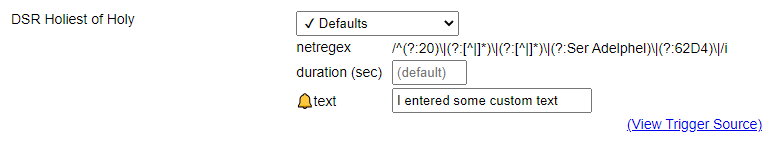
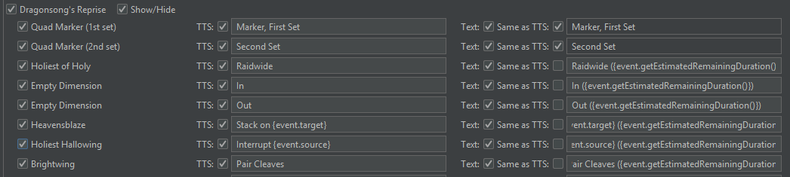
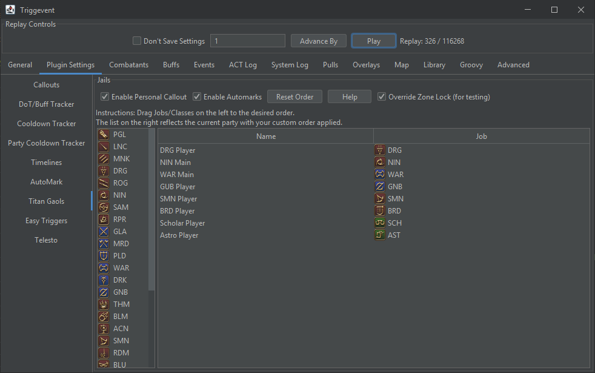
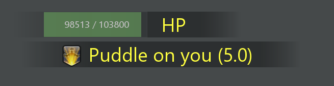

# Triggernometry

Triggernometry is one of the older addons. I myself have done some fairly advanced stuff in it. There is very little that 
Triggernometry *can't* do. Its capabilities are nearly endless.

Rather, the problem is that it doesn't make it easy to *use* those capabilities to their fullest.

If you miss your Weak Auras or similar features from other games - know that Triggernometry is fully capable of doing them. It's just
rare to see it done in practice (and even more rare to see it done *well*), because it's very burdensome for a trigger maker to make
effective use of said tools.

This is not meant to be a rant about the tool, but rather form a part of a design document, by explaining *why* I felt the need
to create an entirely new tool. It's not meant to be an attack, but I also want to be perfectly clear

## Log Lines and Regular Expressions

Triggernometry aims to be more of a generic plugin that isn't tightly coupled to any particular game. However, the downside of this
is that it has to use the lowest common denominator - log lines. This means that in order to really do anything, you'll need to learn
the log line format as well as regular expressions. Both of these are non-trivial endeavors, which raises the barrier of entry.

The idea is, you take a log line that looks like this

```
20|2022-03-29T19:58:58.1570000-07:00|40010363|Hesperos|6A2B|Heart Stake|108A7015|PLD Player|4.70|100.42|100.08|0.00|-2.81|4541079e7a27006f
```

and then you make a regular expression to filter and parse that line:

```regexp
^20\|[^|]+\|[^|]+\|[^|]+\|6A2B\|[^|]+\|[^|]+\|(?<targetName>[^|]+)\|
```

Another one might look like this:

```regexp
^20\|[^|]*\|[^|]*\|[^|]*\|63C7\|[^|]*\|[^|]*\|(?<name>[^|]*)\|
```

And another might look like this:

```regexp
^20\|[^|]*\|[^|]*\|[^|]*\|1234\|[^|]*\|[^|]*\|(?<name>[^|]*)\|
```

You get the idea. Regex is incredibly powerful - to the point where it's arguably overkill for this application due to the very fixed
nature of log lines. You rarely have to look for optional elements or anything like that - it's really not doing anything here that a simple
`string.split('|')` wouldn't do. We know that the 5th field of a 20-line is **always** the ability ID, so we shouldn't make the user
re-define all of this on every trigger.

Wouldn't it be much nicer if we just had a little helper function, so that we could define a regex like this:

```
NetRegexes.startsUsing({ id: '1234', source: 'Some Boss', capture = true })
```

If that looks nicer, first of all you should thank the Cactbot devs for making it. But it's not just a time saver in terms of making regular
expressions. What if we renamed it a bit:

```
Events.startsUsing({ id: '1234', source: 'Some Boss', capture = true })
```

This is just a *normal part of programming* - if you find yourself repeating something, you centralize it as a function somewhere.

But let's look closer - would you even realize you're using regular expressions under the hood? Would you even realize you're dealing with log lines?
Maybe not - at
this point, we've turned not just regular expressions, but also ACT log lines themselves into nothing more than implementation details. I
don't know if the Cactbot devs full appreciate the value of their own work - you *don't need to learn the log line format to make a trigger in
Cactbot!* On top of that, given that there's already programs and APIs for finding ability IDs without needing a log, you may not even need
to have the log file on hand!

So, Cactbot already gets us 90% of the way there. But there's more!

There's a lot of stuff that *isn't* part of the log line at all. For example, you can't tell, just with the log line alone, whether the target
of an ability is the player or not. Nor do you get certain details like NPC IDs. This has to come from other log lines, or other data sources
entirely. This means that on top of conditions implicit in the regex, you also have explicit conditions on the trigger. Thus, while regex
*can* provide certain conditionals (ability IDs in the examples above), you still need to build out more conditions on top of it. Those
conditions themselves would be able to handle the conditions that the regex provides, so it raises the question of "what value is regex
actually giving us?"

Furthermore, there's a maintainability problem for trigger devs. Should the log line format change, triggers will break until they are 
updated. This can be a major change to the log line format, or something that ACT has no control over, like when the crit flags moved around 
in 6.1.

Cactbot works around these issues by centralizing log type definitions. Should some fields change, they can be updated in one place, and all
triggers using that line will be restored to working order.

On the other hand, Triggevent does this a lot differently. Every interesting log line is parsed into a fully-fledged object. Take this trigger, 
for example:

[//]: # (@formatter:off)
```java
@HandleEvents
public void deathsToll(EventContext context, BuffApplied buff) {
  // 0xACA is the buff ID
  if (buff.getBuff().getId() == 0xACA) {
    isDeathsToll = true; // Unrelated to this callout - used to flip the callouts for placement of the Fledgling Flight markers
    // Stack counting down would be considered a refresh
    if (buff.getTarget().isThePlayer() && !buff.isRefresh()) {
      long stacks = buff.getStacks();
      // Change the callout based on buff stacks
      ModifiableCallout<BuffApplied> callout = switch((int) stacks) {
        case 1 -> deathsToll1;
        case 2 -> deathsToll2;
        case 4 -> deathsToll4;
        default -> deathsTollN;
      };
      context.accept(callout.getModified(buff));
    }
  }
}
```
[//]: # (@formatter:on)

Let's break this down. We're looking for a BuffApplied event (i.e. some entity gained a buff or debuff), with an ID of 0xACA. If this is met, we
want to set the variable `isDeathsToll` to true. Furthermore, if the target of the debuff is specifically the player, and it is a fresh application
rather than a refresh, then we want to give a callout. The callout depends on the number of stacks, and the user can customize each callout
independently.

In addition, because the parsing only happens once, should the log line format change, you'll only need to update the parsing code, rather than
*every single trigger that uses that line type*. This can take care of major things, like log line formats changing, as well as minor things like
crit flags shifting around.

On top of that, everything is parsed into the correct type. Numbers will be parsed into int/long or float/double types as necessary. You don't have
to worry about presentation differences like hex vs decimal, because the language handles it for you (i.e. `id == 10` and `id == 0xA` compile the same).

## Customizing Triggers

If you make a trigger for yourself in Triggernometry, you can customize every aspect of it. 
But this conflicts with how triggers are normally distributed. "Remote"
triggers are downloaded from an external repository, and periodically refreshed. However, you *cannot customize these*, other than enabling/disabling them.
You are left with several options, each of which has a downside or two:

- Copy the remote triggers to local. This will let you customize them, but you also will stop receiving updates.
- The developer can use persistent variables plus some means of configuring them to store settings related to the trigger. However, there's
  no easy framework for doing this - it's all manually added by the dev. Not a very scalable solution.
- Use the TTS replacements. This *only* lets you customize TTS replacements - nothing else. It also doesn't give you fine-grained control - what
  happens if two triggers both call out "raidwide", but you only want to change one of them.
- Various other options that aren't particularly user friendly.

Most triggers simply go with #1. A few use #2, which is not user friendly. #3 sometimes works, but not always.

Cactbot solves this by giving each trigger some fields where you can customize it:



This is a good idea, so let's take it further.

Triggevent has the equivalent:



However, it takes it a step further, and allows plugins to provide completely custom configuration UIs for whatever purpose:



Here, we see the config UI for the Titan Gaol plugin. It allows drag-and-drop reordering for the priority list, displays a preview of the party
list with your priority applied, and lets you enable/disable the personal callouts and automarkers, override the zone lock so you can test out
of the instance, and even has a 'Help' button.

If the underlying trigger gets updated, in both Cactbot and Triggevent, you will typically keep your customizations. Both solutions effectively
solve this problem.

## Lack of Code Reuse and Hooking

Making a 'library' function in Triggernometry is doable, but could be more convenient. This is typically done by having a trigger call another
trigger. However, passing data between them could be improved. There's a couple different ways to do it (passing a line, or passing via variables),
but you lose out on type safety and a lot of other things. 

Whereas in both Cactbot and Triggevent, since most triggers are implemented within the codebase (or compiled against it, if you're building your
own personal module), you'd just do it like any other programming task.

Same goes for hooking. Let's say I want to hook into every "Say TTS" action, and have it also invoke a "Text Aura" action. There isn't a direct
way of doing that. You *could* define your own trigger that does both, and have other triggers call that one. But you wouldn't be able to
customize remote triggers to do that, so you'd have to lose out on updates. Plus, without a good way of updating them in bulk, it would be a
large undertaking to do so.

In Triggevent, this is easily supported. You can listen for CalloutEvent or TtsRequest as needed, and do whatever you wish with them. For the
simple case of TTS + on screen text, Triggevent and Cactbot this out of the box. Furthermore, Triggevent also allows for the text to be
dynamically updated, as well as image auras. 

Take these two, for example:



Notice the second one. It shows us the debuff icon, the time remaining, and the text. What did you, as the developer of this trigger,
have to do to accomplish this feat?

[//]: # (@formatter:off)
```java
private final ModifiableCallout<BuffApplied> p1_puddleBait = ModifiableCallout.<BuffApplied>durationBasedCall("Puddle (Place)", "Puddle on you").autoIcon();
```
[//]: # (@formatter:on)

`durationBasedCall` is a helper method that we use instead of the normal `new ModifiableCallout` (ModifiableCallout is what lets us modify
the text on the configuration screen) which adds `{event.getEstimatedRemainingDuration()}` to the end of the text to be displayed.
This is re-evaluated frequently, so the time will count down as the debuff ticks (you can add this manually, you don't need to use the helper
method). In addition, it causes the hang time for the text to be based on the buff duration - it will persist on the screen until the
time that the buff should expire, plus three seconds. Lastly, the `autoIcon()` part automatically selects the debuff icon based on the event
that caused the callout.

But the first one is more interesting. Yep, that's basically a weak aura. It shows Haurchefant's HP in real time, including shields that the in-game
target UI fails to show you. On top of TTS and text, callouts can include completely custom UI elements.

Furthermore, each box in which you can customize your callouts is a fully fledged Groovy script console. You can use any fields available on
the instigating event and much more. This includes conditionals, via the ?: operator (this allows you to implement callout conditions of your
own as well).

## Lack of Testability

This is an area that could be improved in Triggernometry. Currently, there is a 'Test Input' box, allowing you to enter some log lines and see
what they would do. However, this has a few issues. For one, there isn't a way to turn that into an automated test. Secondly, it doesn't emulate
combatants/party data, so there's not a good way of testing triggers that rely on this data at all.

# Hojoring

Hojoring provides a suite of neat tools, like SpeSpe. While it provides a nice basis for DoT and CD tracking, it still places more burden on
the user than is strictly necessary. The ideal way to let the user choose what DoTs/CDs to track is to provide a pre-made list, since there are
only so many of them in the game. If more flexibility is needed, typical cases should require no more than a single ability or status effect
ID, since everything else can be derived from log lines and/or game data (cooldown, charges, ability-to-buff mapping, duration, etc). 

Thus, it suffers from the same probelm of Triggernometry in that it requires the user to learn about log lines and regular expressions. It
worsens this by throwing its own special regex notation into the mix for filtering to the player's character. In addition, it deals with log line
format changes by attempting to convert new-format lines to the older format, thus requiring the user to deliberately find outdated versions of
log line documentation.


# Next Steps

The reason why existing solutions have stuck around for so long is because almost nobody *starts out* doing the super-advanced stuff. Rather,
they start with the simple stuff that's not *too* hard to stumble their way through. They probably started out with simple chat line triggers.  
Then, as you slowly build up to the more advanced applications, you'll run into inconveniences, but never such a huge inconvenience that you
decide 'enough is enough' and split off entirely.

Now, continue reading in [How Triggevent is Different](How-Triggevent-is-Different.md) to see how it actually addresses these issues.
