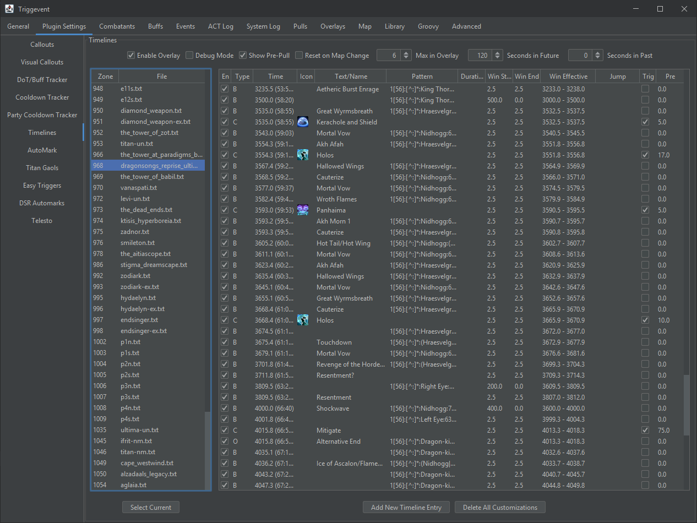
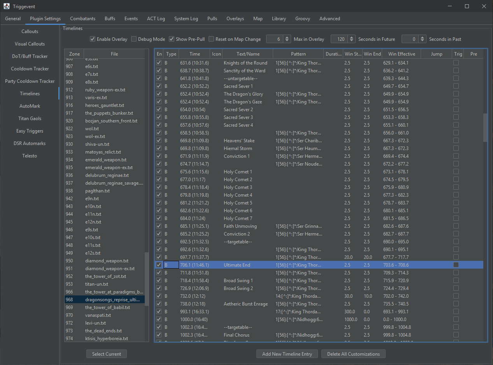
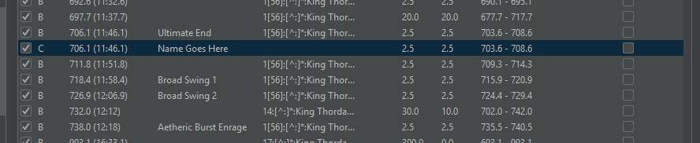
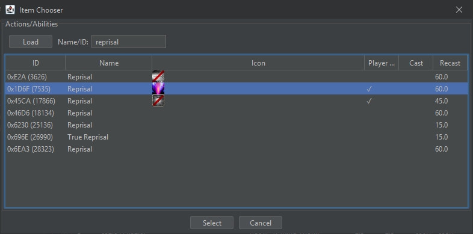
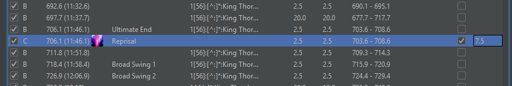
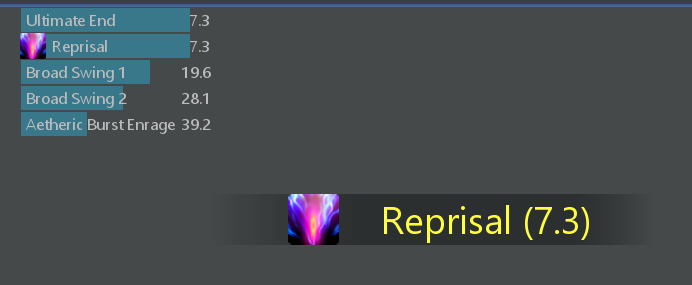

# Timeline Customization

Triggevent supports [Cactbot Timelines](https://github.com/quisquous/cactbot/blob/main/docs/TimelineGuide.md). You should read that link first if you're not familiar with
timeline files.

## Settings

First, let's look at the settings on the top.

* Enable Overlay: Enable or disable the overlay. If disabled, the rest of the page isn't very useful.
* Debug Mode: Displays entries with no text, and adds a * next to the current sync.
* Show Pre-Pull: Shows the timeline before an initial sync has been acquired. 
* Reset on Map Change: Causes the timeline to reset on map changes. Works well for things like alliance raids, but
  doesn't work very well for raids with map changes (e.g. Halicarnassus). I recommend keeping this off.
* Max in Overlay: The most entries that can be displayed in the overlay.
* Seconds in Future: How soon to display upcoming entries. 
* Seconds in Past: How long to display expired entries for.

For example, if "Seconds in Future" is 30, and "Max in Overlay" is 5, then it will display 5 entries if there are at
least 5 entries coming up in the next 30 seconds. If there are less than 5, then it willl display less.

## Editor

First, find the timeline you wish to edit on the left. On the right, all the timeline entries will be displayed.

Let's take a look at what each column means.

### En (Enabled)

Whether this entry is enabled or not. 

If the entry has a sync, you should probably remove the text rather than disabling it. You still want to have sufficient syncs.

### Type

* B: Builtin
* C: Custom User-Added Entry
* O: Builtin entry that has been overridden/customized

### Time

The time in the timeline file. This is not necessarily the fight time, especially on fights with variable phase timings.

### Icon

You can add an icon to the entry which will be displayed next to the text.

You can manually enter a URL, or right click and select "Use Ability Icon" or "Use Status Icon" to use an ability or buff icon.

### Text

The text that will be displayed on the screen. Blank this to have it not be displayed.

### Pattern

The optional sync pattern. These are regular expressions which are checked against parsed ACT log lines (':' delimiters), 
but TE does not consume these from ACT. Rather, they are simply emulated from the network log lines.

### Duration

Optional "active duration" for timeline entries.

### Win Start, Win End

The relative start and end of the sync window. In order to sync to a timeline entry, the log line must match the 'pattern', and the
current time must be within the window of the entry. For example, if the current time is 1000, and the entry has a time of 1030, the
Win Start would need to be at least 30 (assuming the log line matches the regular expression in the 'Pattern' column).

### Win Effective

Read-only column that shows the absolute window. i.e. `Time - Win Start` through `Time + Win End`.

### Jump

Optional. If provided, then instead of syncing to this line's time, it will instead sync to the given time.

### Trig

Whether to turn this into a timeline trigger. If enabled, then when we hit this time, the 'Text' will be turned into a trigger
(TTS and on-screen). 

### Pre

If 'Trig' is on, then this is how long before the given time that the trigger should be fired. It will also have a countdown
on the on-screen text.

### Adding and Removing Entries

There are a few ways to add a new entry. You can select an entry, and click "Add New Timeline Entry" at the bottom. This will insert
a new entry at the same time as the selected entry.

You can also right-click an entry, and select "Clone" to duplicate it.

To remove an entry, right click and select "Delete/Revert". In addition, this will revert overridden entries back to their default.

You cannot delete a built-in entry. Instead, just uncheck "Enabled" (the first column).

To remove all customizations, you can click "Delete All Customizations" which will revert the entire timeline back to its default state.

# Example: Adding Mitigation to a Timeline

Here's how you could add a trigger to your timeline to call out a mitigation usage:

1. Locate the fight you wish to edit the timeline for in the timeline list. Or, if you are already
   in the zone, click "Select Current" in the bottom left.
2. Find the ability you'd like to mitigate and select it in the table. In this example, I'll use Ultimate End in DSR:

3. Click "Add New Timeline Entry" at the bottom. You should see a new entry immediately before or after the entry
you had selected:
 
4. Click into the cell that says "Name Goes Here" and change the name to something more appropriate (e.g. "Reprisal")
5. Check the "Trig" checkbox.
6. In the "Pre" column, specify how early you would like it called out (e.g. 7.5 would mean the callout should 
happen 7.5 seconds beforehand). 
7. Right-click the entry, click "Use Ability Icon", search for "Reprisal" in the list, select the correct one (the one with the icon), 
and click "Select":

8. The final result should look something like this:

9. The name and icon should display on the timeline overlay, and you should receive a callout in addition:

Note that you may also simply edit the time, instead of or in conjunction with the "Pre" time. For example, if you plan to use a mitigation
2 seconds before a mechanic, but would like to be reminded of that 5 seconds before you would press it, then lower the time by 2, and set
Pre to 5.