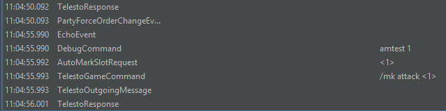
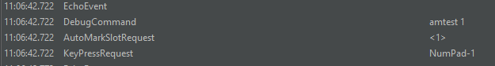
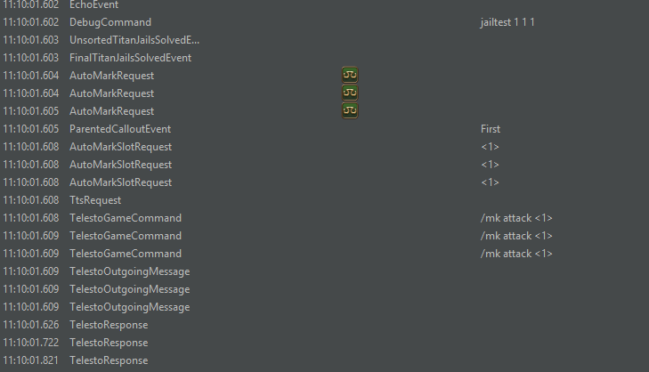

[//]: # (Title: Triggevent Titan Gaol / Jail Plugin / Automarker)

[//]: # (Author: XP)

[//]: # (Tags: #ffxiv, #triggevent, #trigger, #jail, #gaol, #automarker)

[//]: # (Description: Triggevent's jail/gaol plugin provides both a personal callout and automarkers and is easier to set up)

# Titan Gaol Plugin

Or titan jail plugin. Whichever way you want to spell it.

Tired of bad FFXIV UWU gaol plugins that constantly break, are difficult to test, or require manually entering names?
You've come to the right place.
Now you can have one single plugin that covers both personal callouts and automarkers with
drag-and-drop job priority.
You can use classic-style titan gaol macros, or you can use Telesto to skip that step and save a hotbar.

## Overview

The Titan Gaols settings look like this:


### Instructions

First of all, head back to the 'General' tab and make sure the party list is sorted correctly (you will need to be
in the instance for this). If it's not in the correct order, there are two options: Either head on over to
Advanced > Party and make the sorting match your in-game list. Or, you can install Telesto, and enable it in the
Plugin Settings > Telesto tab. This will pull the party list from the game itself (restart the program or
reinstance after enabling this if it still isn't grabbing the correct list).

Then, read on below to configure the priority and choose whether you'd like personal callouts, automarkers, or
both.

#### Job Priority for Jails

Then, on the Plugin Settings > Titan Gaols tab, drag the list to arrange your job priority. Note that if multiple people
plan to run the personal callouts, they should all have the same order. Note that simply using the default order (which
is melee > tanks > caster > ranged > healer) is the easiest way to do this - just hit "Reset Order".

On the right, your party list will show up. This will tell you the actual effective priority for your particular party.

Higher in the prio means you are favored for the low numbers (typically closer to Titan).
Further down means you are prioritized for having the
high-numbered jails (traditionally, towards the outside of the arena).

### Personal Callouts

If you want personal callouts, equivalent to the standalone UWU Titan Jail plugin (Jail_Plugin.dll),
simply click "Enable Personal Callouts". It is very important that everyone use the same ordering
for this, as everyone's client will calculate the order on its own. This is interoperable with Jail_plugin.dll,
if you simply set the same priority order.

### Jail Automarkers

If you want titan gaol automarkers (equivalent to the King Pendragon FFXIVJobPrioGaolAutoMarker and previous iterations),
you'll need to do one of three options:

- Telesto
- Macros on Numpad1-9
- Macros on F1-F9

Head on over to the "AutoMark" tab, and choose your settings accordingly:


Telesto is the easiest option. Just install it, then check 'Use Telesto...'. You can also read more on the
[Telesto Support](Telesto-Support.md) page about how to set up and test Telesto.

To use macros for the titan gaol auto markers instead, choose whether you want to use F1-F9 or Numpad1-9, 
and check/uncheck the 'Use F1-F9' checkbox
accordingly. Then, in-game, make a hotbar bound to those keys, with the following macros:

Numpad1 / F1:

```
/e Marker1
/mk attack <1>
```

Numpad2 / F2:

```
/e Marker2
/mk attack <2>
```

...

Numpad8 / F8:

```
/e Marker8
/mk attack <8>
```

Numpad9 / F9:

```
/e Clear Markers
/mk clear <1>
/mk clear <2>
/mk clear <3>
/mk clear <4>
/mk clear <5>
/mk clear <6>
/mk clear <7>
/mk clear <8>
```

## Testing It

To test that your uwu jail macros are set up and keybound correctly, you can use the in-game command `/e c:amtest 1` which will mark yourself. 
`/e c:amtest 1 3 5`, for example, would mark the first, third, and fifth members of the party. You do not need to be in the instance for
this. If you only mark yourself (i.e. `/e c:amtest 1`), you don't need to be in a party either.

To test titan gaols specifically, if you are in the instance, you can do something like `/e c:jailtest 3 2 8` which will
simulate jails on the third, second, and eighth player in the party. You can do this out of the instance as well
(though you must not be in a normal party, not cross-world), and you must enable the "Override Zone Lock" setting on
the Titan Gaols tab (it is normally only enabled in the Weapon's Refrain instance).

### Testing with a Log File

If you have an actual log file handy, you can preview what the plugin would have done.

1. Run 'triggevent-import.exe' in the install directory.
2. Click "Import ACT Log" and find your log file.
3. Navigate to the "Events" tab
4. For "Event Class", enter `Jail`, then click "Play to Next Matching". It will now play through the log file up until the point where it finds the jail mechanic happening.
5. Now, in "Event Class", enter `/Jail|TTS|AutoMark|Telesto|KeyPress/` (copy and paste it exactly), and check "Scroll to Bottom".

You should see something like this (may vary depending on whether you're using Telesto or macros):


The "AutoMarkRequest" lines indicate which players received jails, sorted by their priority order.
The <8>, <1>, and <4> represent which party slots it would have marked, while the lines below that show the actual
in-game commands used to do the marking via Telesto. For macros, it will instead indicate which keys it would have
pressed.

If the player names/jobs are correct, but not the party slots, check the General tab to see what Triggevent thinks
your party list is. If it is wrong, either correct it in Advanced > Party, or use Telesto. Note that even if you use
Telesto during actual gameplay, it will not work if you are importing a plain log file.

## Troubleshooting

First, try `/e c:amtest 1` in-game. If this doesn't work, here are things to check:

* Is Triggevent receiving any data from ACT? Try using some abilities, and check that they show up
  on the "Events" tab.
* If using Telesto: Go to the Telesto tab (under the "Plugin Settings" tab), and click the "Test" button.
* If using macros: Consider switching to Telesto. Otherwise, check if the macro is getting hit at all -
  the purpose of the '/e' line in the macros is to put some text in your chat log so that you can see if
  the macro is being used or not.

If using Telesto, the "Events" tab should display the following after doing `/e c:amtest 1`:



If using Macros, it should display something like this:



If this works, next, go to the Titan Jail plugin configuration, and check "Override Zone Lock".
Then, do `/e c:jailtest 1 1 1`. This will simulate getting all three gaols on yourself.
Note that you will need to do `/e c:jailreset` to simulate a wipe before using the jailtest
command again.

You should see something like this:



The last thing to check is to use a few abilities on a dummy, and make sure that they
show up on the events tab. After game update, sometimes chat logs will still work while
abilities and such will break until the ACT parsing plugin is updated.

### It Worked, but Marked Wrong Players

This is almost always an issue of incorrect party list sorting. The easiest fix is to
[use Telesto for your party list](Telesto-Support.md). If you don't want to use
Telesto, go to Advanced > Party and make sure it is configured exactly the same as your
in-game party sort.

