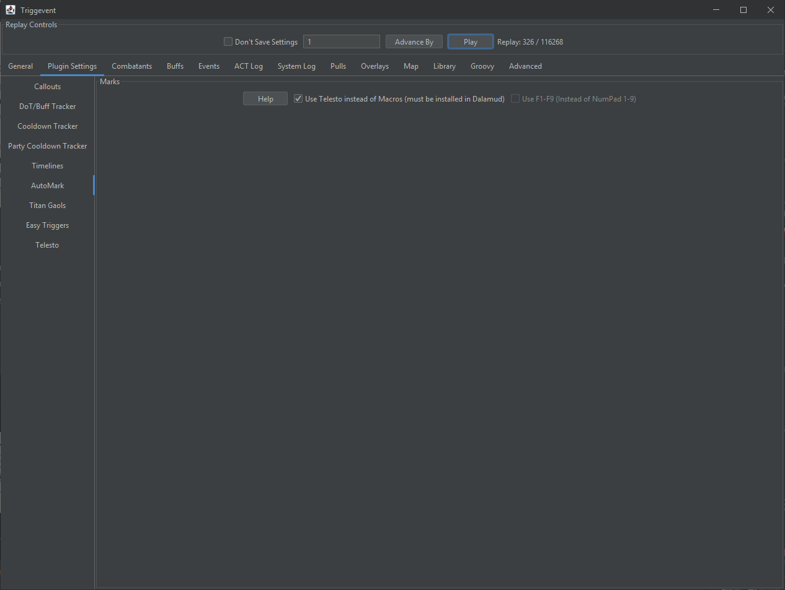

[//]: # (Title: Triggevent Titan Gaol / Jail Plugin / Automarker)

[//]: # (Author: XP)

[//]: # (Tags: #ffxiv, #triggevent, #trigger, #jail, #gaol, #automarker)

[//]: # (Description: Triggevent's jail/gaol plugin provides both a personal callout and automarkers and is easier to set up)

# Titan Gaol Plugin

Or titan jail plugin. Whichever way you want to spell it.

Tired of bad UWU gaol plugins that constantly break, are difficult to test, or require manually entering names? You've come
to the right place. Now you can have one single plugin that covers both personal callouts and automarkers with 
drag-and-drop job priority.

## Overview

The Titan Gaols settings look like this:


### Instructions

First of all, head back to the 'General' tab and make sure the party list is sorted correctly (you will need to be 
in the instance for this). If it's not in the correct order, there are two options: Either head on over to
Advanced > Party and make the sorting match your in-game list. Or, you can install Telesto, and enable it in the 
Plugin Settings > Telesto tab. This will pull the party list from the game itself (restart the program or 
reinstance after enabling this if it still isn't grabbing the correct list). 

Then, on the Plugin Settings > Titan Gaols tab, drag the list to arrange your job priority. Note that if multiple people
plan to run the personal callouts, they should all have the same order. Note that simply using the default order (which
is melee > tanks > caster > ranged > healer) is the easiest way to do this - just hit "Reset Order".

On the right, your party list will show up. This will tell you the actual effective priority for your particular party.

### Personal Callouts

If you want personal callouts, equivalent to the standalone Titan Jail plugin, simply click "Enable Personal Callouts".

### Automarkers

If you want titan jail automarkers, you'll need to do one of three options:
- Telesto
- Macros on Numpad1-9
- Macros on F1-F9

Head on over to the "AutoMark" tab, and choose your settings accordingly:



Telesto is the easiest option. Just install it, then check 'Use Telesto...'.

To use macros instead, choose whether you want to use F1-F9 or Numpad1-9, and check/uncheck the 'Use F1-F9' checkbox
accordingly. Then, in-game, make a hotbar bound to those keys, with the following macros:

Numpad1 / F1:

```
/e Marker1
/mk attack <1>
```

Numpad2 / F2:
```
/e Marker2
/mk attack <2>
```

...

Numpad8 / F8:
```
/e Marker8
/mk attack <8>
```

Numpad9 / F9:
```
/e Clear Markers
/mk clear <1>
/mk clear <2>
/mk clear <3>
/mk clear <4>
/mk clear <5>
/mk clear <6>
/mk clear <7>
/mk clear <8>
```

## Testing It

To test the macro alone, you can use the in-game command `/e amtest 1` which will mark yourself. `/e amtest 1 3 5`, 
for example, would mark the first, third, and fifth members of the party. You do not need to be in the instance for 
this.

To test gaols specifically, if you are in the instance, you can do something like `/e jailtest 3 2 8` which will 
simulate jails on the third, second, and eighth player in the party. You can do this out of the instance as well 
(though you must not be in a normal party, not cross-world), and you must enable the "Override Zone Lock" setting on 
the Titan Gaols tab (it is normally only enabled in the Weapon's Refrain instance).