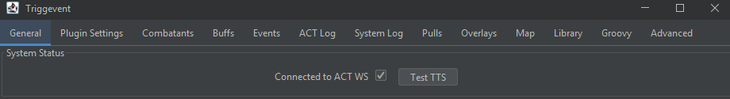
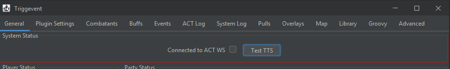
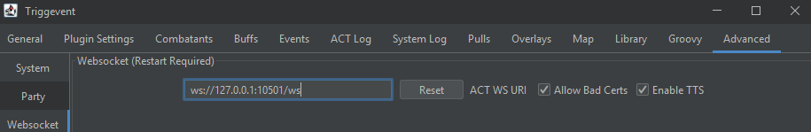
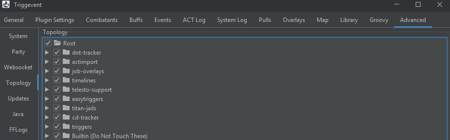
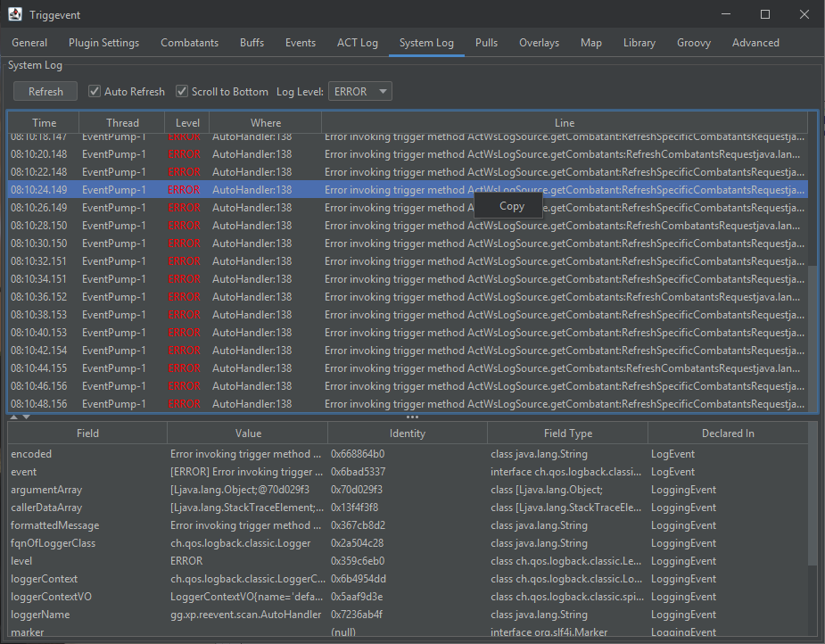

# General Troubleshooting

Whatever the problem may be, let's start with a few basics. 

## Websocket

First, look at the top of the main tab. It should look like this:

Click the 'Test TTS' button, and you should hear your ACT say "Test".

If it looks like this, then it is not connected:

If this happens, make sure your OverlayPlugin WebSocket Server settings are correct, both on the ACT end 
(Plugins > OverlayPlugin WSServer > Stream/Local Overlay) and in Triggevent (Advanced > Websocket). The default
settings should look like this:

Restart both ACT and TE, and it should be connected.

## Events

Things that you and other players do, such as ability usage, should appear in the "Events" tab. If they do not, but
TE says it is connected to Websocket, it could be that your ACT is not working (possibly due to a recent game update).
If your DPS numbers aren't working in ACT, it is unlikely that anything would work in Triggevent (or any other ACT-based addon).

## Topology

Make sure nothing is unchecked in here, including nested items.

## Overlays

In addition to everything else, if an overlay is not showing up when you expect it to:

1. Check the "Overlays" tab. Make sure the desired overlay is enabled, and is not set to zero opacity.
2. Click the "Edit" button. You should see an outline of each overlay (a pink border with the name of the overlay).
   - If you don't see this, try manually setting values in the Overlays table. Give it X and Y of 100, scale of 1.0, and 100% opacity.
3. Try some other overlays to see if they show up. 
   - The 'Party Overlay' should always list yourself if ACT and the game are running.
   - The 'Callout Text' overlay will show a dummy callout if you do `/e c:testcall` in-game.

## System Log

You can quickly check for internal errors by opening the "System Log" tab, and setting the Log Level to ERROR. The full error text
is accessible via right-click -> copy:

The log is also accessible in text form. Go to Advanced > System > Open Settings Dir, and you will find 'triggevent.log'.

# Last Resort Options

You can click the Advanced > System > Open Settings Dir to find your settings files. The main file is `triggevent.properties`,
along with its automatic backup `triggevent.properties.backup`. 

You can temporarily rename these files to start with new, fresh settings. If this fixes the problem, then it is likely
that there is an issue with your settings.

# Specific Issues

## Some Triggers/Overlays Don't Work in an FFLogs Replay

This can be caused by two different things:

1. FFLogs simply does not have certain pieces of information, such as headmarkers and tethers. Triggers that use these
will not work as a result.
2. You need to tell Triggevent which player to consider "You". To do so, play some events until the party list shows
up on the General tab, and then right-click a player and select "Set as primary player".

## Jail/Automark Issues

See [Titan Jail Troubleshooting](Titan-Jail.md#Troubleshooting)