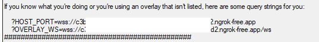
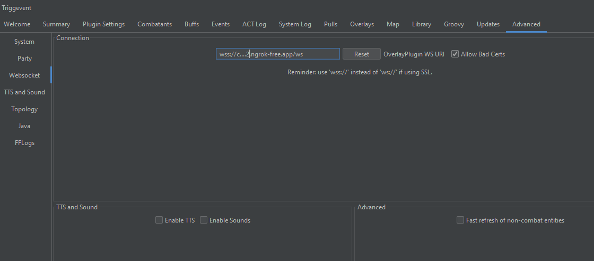
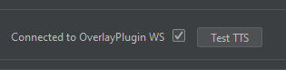
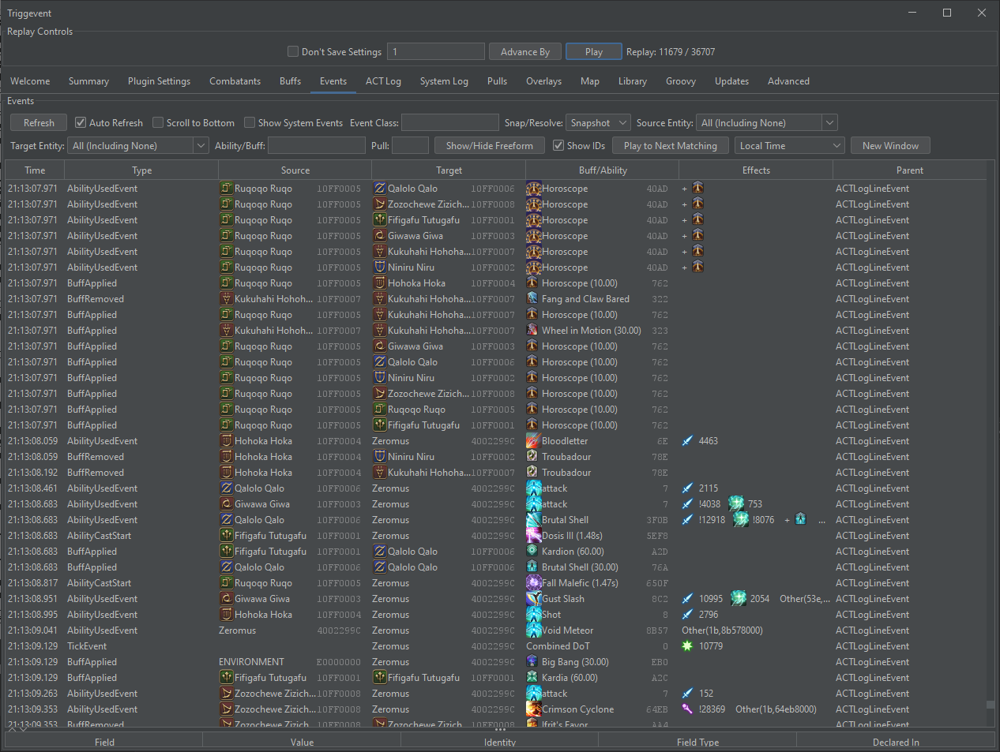
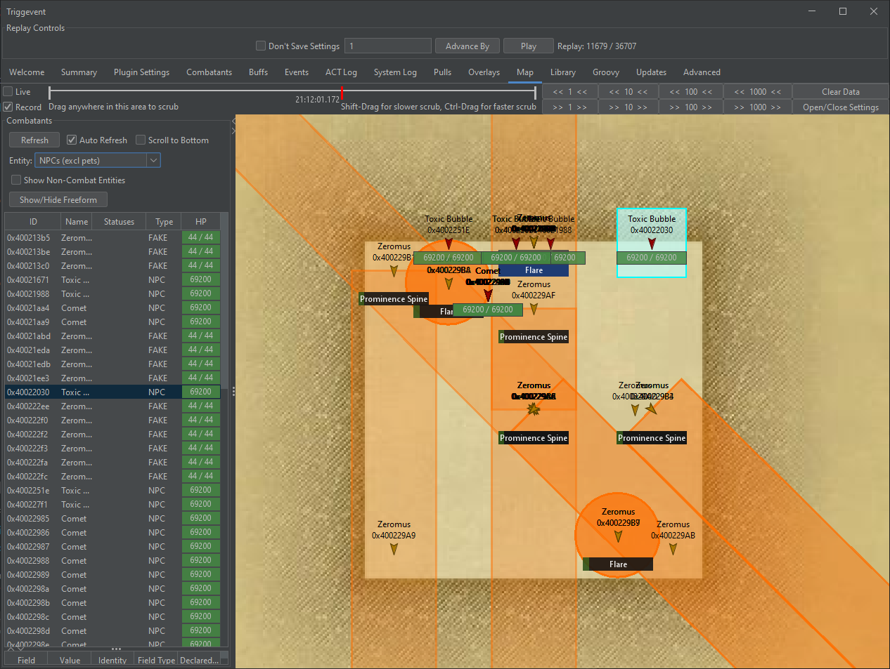

This guide covers how to use Triggevent in a 9th man scenario, to allow for real-time log analysis.

# Installation

You can use an existing installation, or use a separate installation with its own settings so that you don't need to
switch back and forth between configurations if you use it for normal gameplay. The latter is covered in the
[Using a Completely Separate Installation](#using-a-completely-separate-installation) section. This section will cover
the former option.

First start by following the [Standard Installation Instructions](https://github.com/xpdota/event-trigger/wiki/Installation-and-Setup).
However, you do not need to have your local ACT set up. Only the raid member you will be connecting to needs to set it up.
Then, have one of your raid members either set up NGrok in their OverlayPlugin, or set up a normal port forwarding.
Finally, make a few changes to your Triggevent configuration.

## NGrok

If you are using NGrok, then in ACT, navigate to Plugins > OverlayPlugin WSServer > Shared Overlay. After entering the NGrok
token and clicking "Start", you should see something like this in the output:

You want to use the latter URL - the one beginning with `ws://` or `wss://` and ending with `/ws`.

In Triggevent go to Advanced > WebSocket. Change the URL to this URL. Enable 'Allow Bad Certs'.

Now, you will most likely want to uncheck 'Enable TTS' and 'Enable Sounds'. Otherwise, your local triggers will send
callouts to the remote ACT.

When all of this is complete, the tab should look like this:

Restart Triggevent, and verify on the home screen that it is connected:

## Port Forwarding

If the raid member is going to use plain port forwarding, the procedure is similar.

In ACT, go to Plugins > OverlayPlugin WSServer > Stream/Local Overlay. Change the IP Address to `*`.
Leave SSL disabled, unless you know you need it for another application.
Set up port forwarding on the router.

Then, in Triggevent, do the same procedure as with NGrok, but use a URL that looks like this:

`ws://1.2.3.4:10501/ws`

Where the first part is `ws://` if not using SSL, or `wss://` if you are. The next part, `1.2.3.4` should be replaced with the public
IP address of the raid member. `10501` is the public port you are using (if different from the internal port - unlikely, but possible).

Restart Triggevent, and verify connection on the home screen. Don't forget to disable TTS and audio.

# Ninth Manning Capabilities

Anything that works locally should also work remotely, minus additional plugins which would require their own separate port forwards
or NGrok tunnels. Events, map, and triggers should still work.

In addition, if you would like to have a different player be treated as the primary player, once you are zoned in, on the home screen,
right-click the player in question and select "Set As Primary Player".

## Events Tab

The events tab is the bread and butter of log analysis. It shows everything that happened. This is likely too much data to be useful,
so you will want to use the filters to narrow down for what you're looking for.

The 'Event Class' lets you filter by the type of event. The most common types you would be interested in are `AbilityCastStart`, `AbilityUsedEvent`,
`BuffApplied`, and `BuffRemoved`. You can enter a partial string, e.g. `Cast` will match `AbilityCastStart`. You can also put a regex pattern
in slashes, e.g. `/Buff|Ability/` to match all of the above.

Source entity and target entity allow you to filter events down based on the type or name of the source or target. For example,
to find boss abilities, you can change the 'Source Entity' dropdown to NPCs. If you want to find things that hit a specific player,
you can enter the players name as the Target Entity.

Ability/Buff lets you filter to a specific ability or status effect name. Like the event class, this lets you filter via a substring match,
e.g. 'Meteor' will match 'Meteor Impact', or with `/regex/`.

The 'New Window' button allows you to open multiple events windows, to view multiple queries at once.

Finally, the 'Show/Hide Freeform' button will show a freeform query field which takes [Groovy](/pages/groovy/Groovy-Scripting.md).
It uses 'event' as the variable name. For example, to see only events that dealt damage to players, you can enter
`event.damage > 0 && event.target.isPc()`. For more advanced queries, I recommend defining the query as a function in a Groovy script, and
referencing it accordingly. See [Custom Search Filters](https://github.com/xpdota/event-trigger/wiki/Groovy-Examples#custom-search-filters).

## Map Tab

The map tab acts as a live view, with instant replay capabilities.

First, MAKE SURE TO ENABLE RECORDING. You can check the 'Record' box. If you do not enable recording, you will only have a live view - you
will not be able to rewind. Click 'Open/Close Settings' to adjust the number and frequency of snapshots, as well as what is displayed in
the field.

You can filter the map tab by filtering the combatants list on the left, and with some of the settings on the right.

You can rewind and fast-forward by dragging the red/green bar left and right, or by using the back/forward 1/10/100/1000 buttons on the right.
You can also click the 'Live' checkbox to go back to live playback.

Note that AoEs are effectively a guess. They are displayed on a best-effort basis using what is available in the game data.
It cannot predict the size or shape of every ability, especially cones and donuts.

## Overlays

While generally not of much interest for ninth manning, Overlays can be forced on by using the 'Force Visible Event When Game Inactive' checkbox.
This will allow you to use overlays such as the custom party overlay, and the party cooldown tracker.

## ACT Log

The ACT Log tab is a searchable version of the raw ACT log. You can search via strings or regex as usual.

## Groovy Scripts

See [Groovy Scripting](/pages/groovy/Groovy-Scripting.md). You can do everything you would do during normal gameplay, including
creating custom search filters, triggers, and more advanced inspection of events.

## Library

The library tab gives you access to specific pieces of game data, including actions/abilities, status effects, and RSV (obfuscated) entries.

# Other Information

## Using a Completely Separate Installation

To keep settings separate, copy and paste your installation directory. Open the new installation (close the other one if it is still open).
Navigate to Advanced > Java, and add ` -Dtriggevent_settings_dir=settings`. Close the application, and create an empty folder called
'settings' in the installation directory. This will cause this specific copy of Triggevent to use an isolated settings directory.

## Hearing Audio Locally

If you wish to still hear callout audio locally, in Advanced > TTS and Sound, enable "Local TTS as Fallback", and "Local Sound as Fallback".
You may also wish to disable "Local TTS Blocking Mode" to allow multiple callouts to play at once.