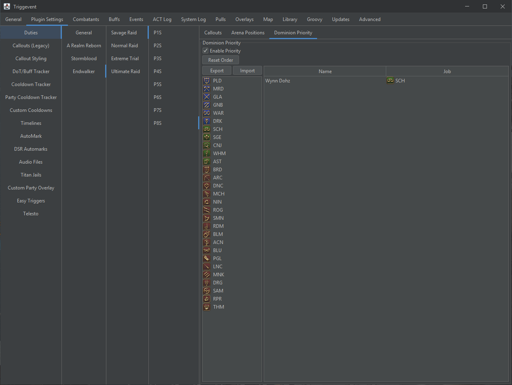

# Abyssos Triggers

Current status: Done apart from a few mechanics here and there.

## P5S

Most major mechanics are complete. Unfortunately, it does not seem possible at this time to make triggers
for the jumping mechanic where the boss is untargetable. 

- Searing Ray/Reflected
- Raidwides: Ruby Glow, Sonic How
- Tankbuster: Toxic Crunch
- Venom Squall/Surge
- Double Rush
- Venomous Mass
- Claw to Tail/Tail to Claw
- Safe spot for first ruby ray
- Topaz Cluster - calls all safe spots initially, then guides you through each movement

## P6S

As with P5S, most mechanics are done, but the floor tiles mechanics rely on MapEffect lines which are
not widely supported yet. These may be added to OverlayPlugin soon, in which case it will be possible to
do them.

- Aetheric Polyominoid (generic tile callout)
- Chelic Synergy (Tankbuster)
- Unholy Darkness (Healer Stacks)
- Exocleaver (Protean Cleave)
- Choros Ixou Sides or Front/Back First
- Hemitheos's Dark IV (Raidwide)
- Synergy (Tankbuster)
- Dark Ashes Spread
- Dark Sphere
- Donut/Flare/Stack mechanics
- Dark Dome Bait/Move
- Cachexia Callouts (one callout for each combination)
- Look out/Look in

## P7S

Most mechanics are done. 

A couple are still needed, namely:
- Exaflare direction
- A few tethers

Completed:
- Bough of Attis Close/Far/Left/Right
- Dispered/Condensed Aero II (Tank Spread/Stack)
- Spark of Life
- Exaflare
- Light of Life
- Wind/Holy (Stack/Spread Debuffs, supports both the 2-mechanic set and 4-mechanic set)
- Famine's Harvest - Tether or No Tether
- Death's Harvest - Calls CW/CCW and which spot to avoid
- War's Harvest:
  - Io Tether
  - Mino Tether (Far from Lightning)
  - Mino Tether (Adjacent to Lightning)
  - Bird Tether (Adjacent to Empty Bridge)
  - Bird Tether (Adjacent to Both Occupied Bridges)

## P8S Part 1

Done, including Fourfold safe spots for follow-up hits.

- Genesis of Flame
- Octaflare/Tetraflare/Diflare, including delayed versions
- Torch Flames: Safe spot for all three sets
- Flameviper (Buster)
- Genesis of Flame (Raidwide)
- Sunforge (In/Out with delayed octa/tetra)
- Dog Form 1
  - Calls your number, and when to bait
- Snake Form 1
  - Calls whether you have first or second puddle or gaze, and snake locations
  - Also calls out when the gaze actually snapshots because for some reason, it's not at the end of the cast bar
  - Raidwide after
- Double Pinion
  - North/South, East/West, Inside, Corners/Outside
  - Whether or not to bait second proteans
  - Nest of Flamevipers
- Fourfold Fires: First, Second, Third safe spot
- Snake Form 2
  - Gazing first or second
  - Gaze snapshot
  - Where to stack, and whether you're in front or not
- Dog Form 2
  - Initial Away/Towards boss facing
  - Light Parties/Partners
  - Both Movements (note: does not indicate if you need to wait for a crush to go off)

## P8S Part 2

Done. There are a very large number of callout options for HC2 to accomodate as many strats
as possible.

- Tyrant's Unholy Darkness (Buster)
- Aioniopyre (Bleedwide)
- Aionagonia (Bleedwide)
- Natural Alignment Buff: On you, on your role, on other role
- Natural Alignment 1:
  - Bait then stack/spread/avoid
  - Cleave and spread/stack/avoid
  - Ice/Fire 
    - Separate calls for NA buff, as NA buff role, as other role
    - Calls which row is safe
- High Concept 1:
  - Initial cast
  - Initial debuff
  - Possibly doing alchemy, or definitely not doing first alchemy
    - Tower color is not in the log, so instead it calls out which tower colors indicate you
      will be doing alchemy (e.g. "Alch if Green or Blue Tower")
  - Cleave safe side
  - Followup call for each debuff combination
    - Also has separate calls for if you were the unused short letter, since some strats use them as a marker
      to indicate which is not needed.
  - Possibly doing second alchemy, or definitely not doing second alchemy
- Limitless Desolation
  - Initial spread call
  - Calls your number, and when to soak
- Natural Alignment 2:
  - Stack/Spread/Avoid, in which row
  - Ice/Fire/Avoid, in which row
  - Reverse is handled automatically
  - Cleave safe spot afterwards
- High Concept 2:
  - Intitial cast
  - Initial debuff
    - Note that solosplice/multisplice take precendence over letter for this
  - Post-defamation call for each starting debuff set (solo/multi do NOT take precendence here)
    - Once again, the tower color is not in the log, so it simply tells you which colors to do
  - Calls for second sets of defamations, including separate 
  - Calls for whether or not to do second alchemy
    - These are not dependent on tower color, so it is a concrete call rather than calling the tower color
    - Also supports a separate call for whichever color was initially unused
  - Prey Marker
  - Make Phoenix
  - Heal to full reminder
- Dominion
  - Initial Spread
  - Calls whether you're in first set or second set
  - Plus a prio - see below

### Dominion

This is disabled by default, but can be enabled. It works like the [Titan Jail plugin](/pages/Titan-Jail.md),
but is only a personal callout (no automarks). The required setup is to set up your priority list, where higher
up on the list indicates that they will take a left tower, and lower indicates that they will take a right
tower:

It will give you two callouts. The first is which tower set and number you are (1 = leftmost, 4 = rightmost).
The second callout is the actual tower position you will be taking. 1 is the leftmost tower, 5 is the middle
tower, and 9 is the rightmost tower. Feel free to customize the callouts to whatever makes the most sense
to you.