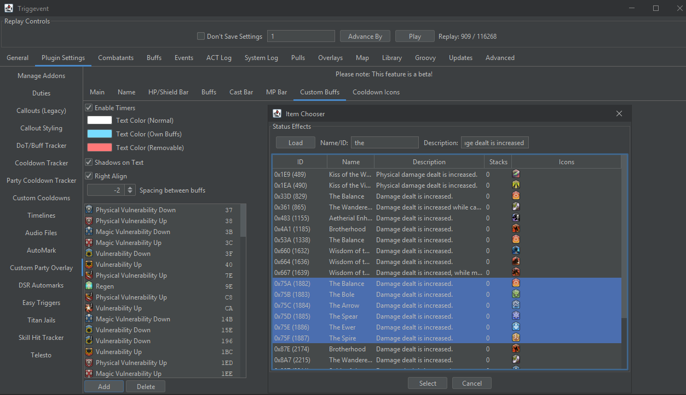

# AST Card Buff Timers Mini-Guide

1. Enable the "Custom Party List" overlay on the Overlays tab.
2. Navigate to Plugin Settings > Custom Party Overlay.
3. Enable the "Custom Buffs" component.
4. Disable any components you do not want (possibly all of the others if you aim to augment rather than replace the in-game party list).
5. Drag and drop the custom buffs component to the desired location (leave it at 0,0 if you don't plan to use any other components) and adjust to your desired size.
6. On the Custom Buffs tab, add the AST card buffs (tip: search for name "the" and description "damage dealt is increased", then shift-click to select multiple):
   

7. Back on the Overlays tab, enable edit mode, and position/resize the overlay (use the scroll wheel while hovering over the pink border) such that they appear on your in-game party list where desired. Also use the "Y Offset Between Party Members" as another adjustment.

To make it easier to see the final placement, I recommend adding another buff to the list which you can easily throw on all players, such as the Aspected Helios buff.

The end result should look something like this:

