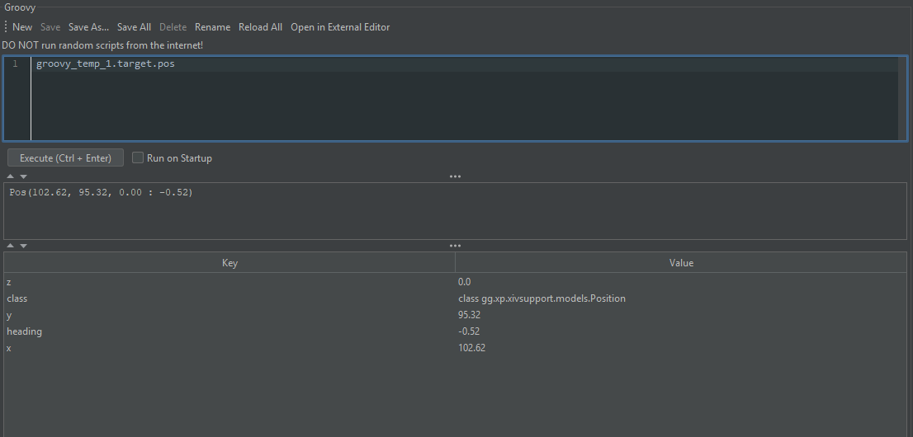

# The Events Tab

The events tab is where you can go to see everything that has happened since opening the program and connecting to ACT (or since opening a replay):


Here, you see lines roughly equivalent to what you'd see in ACT, but in a more human-readable format.

Note that if you are playing a replay, it will not play through the events until you tell it to do so via the "Play" button at the top, or the "Play to Next Matching" button.

## Columns

From left to right, the columns are:

- Timestamp: The time when the event occurred. You can switch this to be relative to the currently-selected event using the "Local Time/Relative to Selection" dropdown.
- Type: The type of event. For example, AbilityUsedEvent corresponds to an ability snapshotting. BuffApplied corresponds to a status effect being applied to something.
- Source: If the event was caused by a specific combatant, this shows you which one.
- Target: If the event is targeted on a specific combatant, this shows you which one.
- Buff/Ability: The buff or ability that the event is for, or whatever the main focus of the particular event is.
- Effects: Any additional effects caused by the event, such as damage, healing, or applying a status effect.

## Controls

- Refresh button: Refresh now. Irrelevant if "Auto Refresh" is checked.
- Auto Refresh: Refresh when there is a new event, rather than manually.
- Scroll to Bottom: Keep the view scrolled to the bottom.
- Show IDs: Also show hex IDs for abilities, entities, and status effects.
- Play to Next Matching (replay only): Play through the replay until we see another event that matches your current filters.
- Local Time vs Relative Time dropdown: By switching this to "Relative Time", instead of absolute timestamps, you will instead see a delta relative to the currently-selected event.

## Filters

- Event Class: What type of event to filter to. If surrounded by slashes, it will be treated as a regex. Otherwise, it is treated as a simple substring. e.g. `AbilityUsed` and `/Used|Cast|TTS/` would both be acceptable.
- Snap/Resolve: Whether to show abilities when they snapshot (AbilityUsedEvent), when they resolve (AbilityResolvedEvent), or both.
- Source Entity: Filter events based on their "Source" - you can elect to only show yourself, players, NPCs, or other types. You can also type a name, or an ID in hex form (`0x1001ABCD`).
- Target Entity: Same as Source Entity, but for the ability target.
- Ability/Buff: Search for specific ability/status IDs. Accepts a plain string, `/regex/`, a base 10 ID (e.g. `185`), or a hex ID (`0xB9`).
- Pull: Pull number to filter to. See the "Pulls" tab. You can also right-click one of the pulls on the pulls tab, and select "Filter Events Tab".
- Show/Hide Freeform: Shows/Hides the groovy filter (see below).

## Freeform

The freeform field supports Groovy expressions. To use it, first click the "Show/Hide Freeform" button, then enter a query in the box that appears below.

Here are some examples:

- `event.damage` - filter to only events that dealt damage
- `event.damage > 10000` - filter to only events that dealt damage in excess of 10,000
- `event instanceof HasStatusEffect` - filter to only events associated with an ability
- `event.damage && event.target.isThePlayer()` - filter to damaging events against yourself

You can also use the Groovy tab to define a filter function, then reference it. For example, make a new script, check the "Run on Startup" box, put this in, then save and run it:

```groovy
def isNpc(XivCombatant combatant) {
    return combatant.type == CombatantType.NPC || combatant.type == CombatantType.FAKE || combatant.isEnvironment()
}
globals.noPlayerAbilities = event -> {
    if ((event instanceof HasAbility || event instanceof HasStatusEffect) && event instanceof HasSourceEntity) {
        if (!isNpc(event.source)) {
            return false
        }
    }
    if (event instanceof StatusEffectList && !isNpc(event.target)) {
        return false
    }
    if (event instanceof TickEvent) {
        return false
    }
    if ((event instanceof HasTargetEntity || event instanceof HasSourceEntity) && event.target.type == CombatantType.PET) {
        return false
    }
    if (event instanceof StatusEffectList && (event.target.name == null || event.target.name.isEmpty())) {
        return false
    }
    return true
}
```

Now, you'll be able to use `noPlayerAbilities(event)` (or `noPlayerAbilities event` as a filter). 
This will filter out most player-initiated actions, as well as actions involving a pet (which would otherwise be considered an NPC).

### Diving Further into Events and their Properties

To poke around with a particular event in order to make filters for it, right click it and select "Save As Temp Variable".

Then, in the Groovy scratch console, run a script with nothing but that variable name:


The list at the bottom will show you all the properties you can use on that events.

You can poke further into these:



Now, armed with this knowledge, let's filter to only damaging abilities that hit players who were standing on the East side of the arena (the center is typically 100,100):

