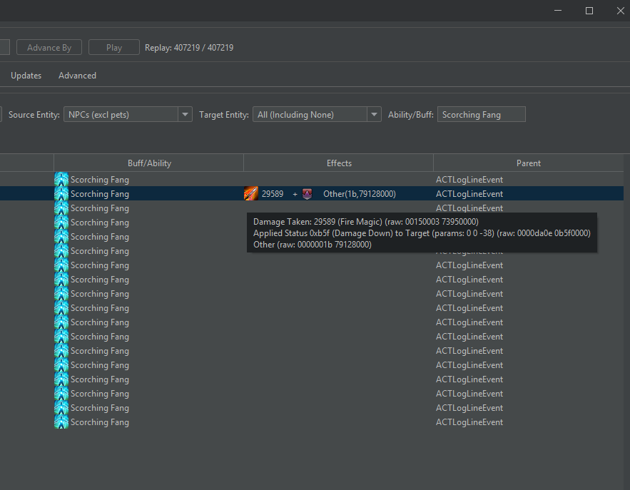
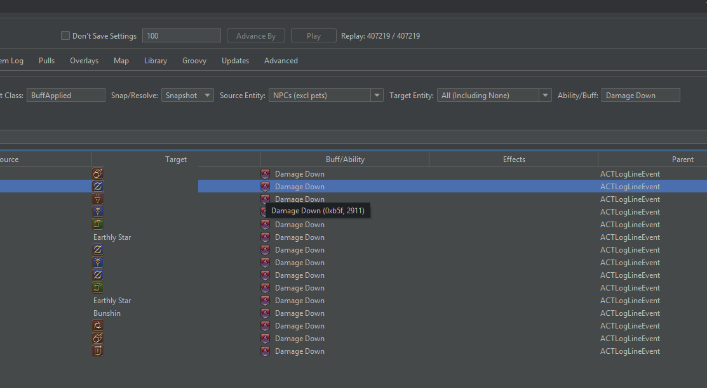
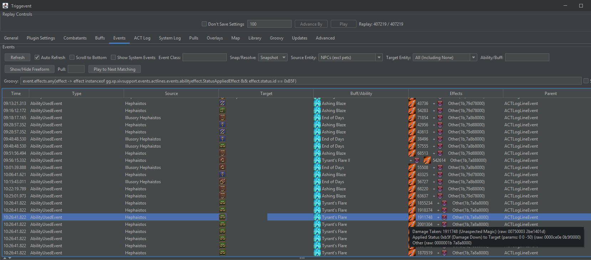
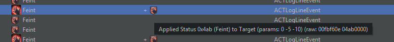
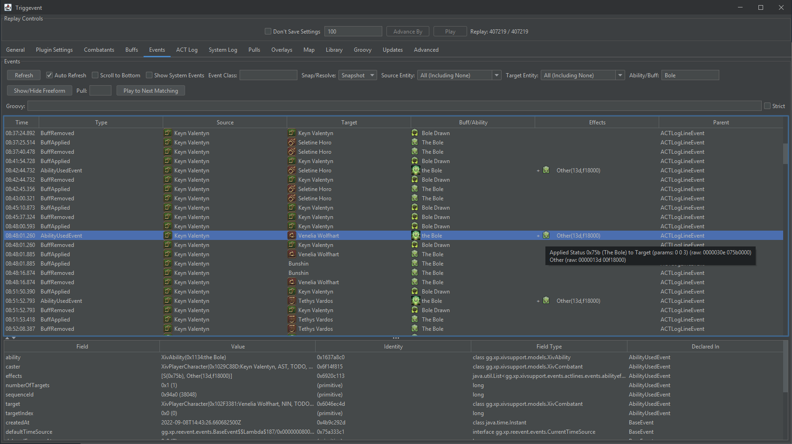
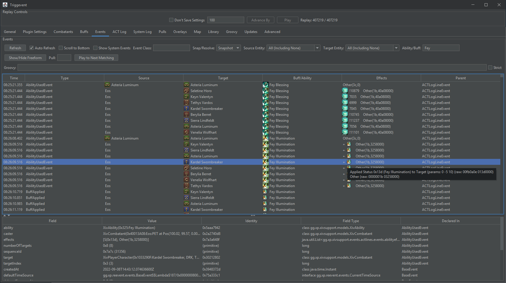

# About Damage Downs, Damage Buffs, Vulns

When you use an ability that applies a buff, some extra information is available in the ACT log line.
This information is sometimes visible to the user (such as the stack count), but other information
is often sent in the packet. For damage buffs, mitigations, vulns, and such, the reduction/increase
is part of this data.

## The Easy Way

Load the log in Triggevent and play until the damage down happens.

If you know the name of the ability that applied the damage down, simple search for that ability in the
'Ability/Buff' field:

Hover over the 'Effects' icons, and look for the line that talks about the damage down. Read the 'params'.
In this case, we have 0, 0, and -38. The zeroes can be ignored, and -38 means that this is a 38% damage down.

If you know the ability ID rather than the name, search for the hex ID by entering it in '0x1234' format
instead of the class name.

If you have no idea what ability applied the DD, first search for 'Event Class: BuffApplied' and 
'Ability/Buff: Damage Down'. This will give you the ID. In this case, it is 0xB5F:

Now, clear all your filters, click 'Show/Hide Freeform', uncheck the 'Strict' checkbox all the way
on the right, and enter a search query like this (replace B5F with the ID you found):

`event.effects.any{effect -> effect instanceof gg.xp.xivsupport.events.actlines.events.abilityeffect.StatusAppliedEffect && effect.status.id == 0xB5F}`

Then, read the values as usual:

In this case, we see '0 0 -50', so it is a 50% damage down.

### Other Types of Buffs

This same trick works with:

#### Mitigations and Vulns

Here, we see that Feint has -5 and -10, which correspond to its 5% magic and 10% physical reductions.

A positive value typically indicates an increase in damage dealt, or an increase in damage taken, while a negative
value indicates a reduction in damage taken or dealt. This is not *always* the case - for example, Mug applies a +5
status to the target (+5% damage taken), but Chain Strategem applies a -10 status to the target (+10% crits taken).

#### Damage Buffs

A good example is AST cards. Since they can be 3% or 6% depending on target, you can check what the actual percentage
was in the log:

In this case, it is only 3% because a ranged card was played on a melee.

#### Healing Up

Here we see the 5% mitigation and 10% healing up from Fey Illumination.

## The Hard Way

You can do this with a raw log file, but it is more difficult.

You'll need to find the 21/22-line corresponding to the ability. In this case, Addle:

`21|2022-09-05T00:00:02.3140000+08:00|10327D18|Name Removed|1D88|Addle|40014BD9|Hephaistos|F6FB0E|4B30000|0|0|0|0|0|0|0|0|0|0|0|0|0|0|26209597|33218076|10000|10000|||100.00|77.00|0.00|0.00|63681|63681|0|10000|||102.59|98.95|0.00|-3.02|0000A230|0|1|a5bf435d0da63215`

The 16 fields after the target name are eight pairs of effect flags and values. We're looking for one with either `0E` (status applied to target) or `0F` (status applied to caster).
In this case, we see `F6FB0E` as the flags, and `4B30000` as the value. `4B3` is the status effect ID for addle, so this is the one we want to look at (this is a simpler
example, but some abilities may apply 2 or 3 statuses and you'll need to figure out which is which).

NNext, we break down the three leftmost bytes in the flags value into 8-bit signed integers (note that ACT will not write out leading zeroes for this field, so 
`F6FB0E` is really `00F6FB0E`. In this case, `00`, `F6`, and `FB`. Converting to base 10, we get 0, -10, -5, which correspond to the 10% magic reduction and 5% physical
reduction on Addle.

An example of a line with multiple buff applications might look like this:

`22|2022-09-04T23:23:08.9310000+08:00|102B4E61|Name Removed|64B9|Radiant Finale|102B4E61|Name Removed|20E|B940000|F|AA28000|1B|64B98000|0|0|0|0|0|0|0|0|0|0|67593|67593|10000|10000|||92.30|100.42|0.00|1.67|67593|67593|10000|10000|||92.30|100.42|0.00|1.67|000075A0|0|8|dfdeb000d8342d05`

Here, we have `B94` applied to the target, and `AA2` applied to the caster (in this case, the caster and target are the same, so it makes no difference).
The corresponding flags are `000002` and `000000` - so we know that the first buff is applying a 2% damage bonus.
