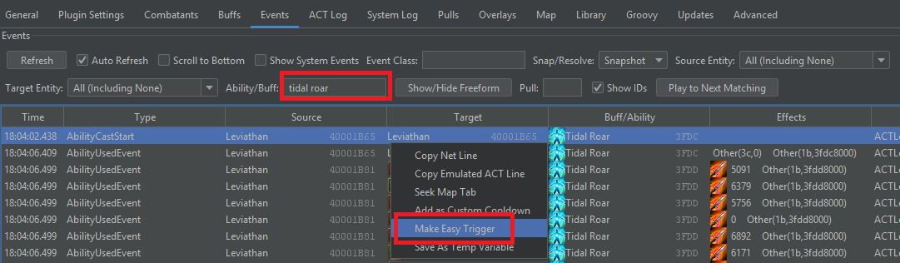
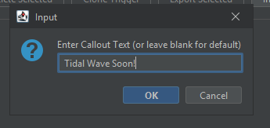
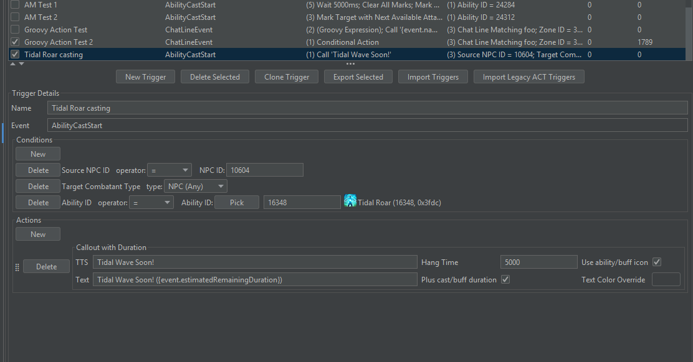

# Introduction

Old trigger solutions require you to learn way too much just to make simple triggers, or cut corners
and end up with something that might break down the line when you change your chat settings.

In addition to all the built-in triggers, "Easy Triggers" is a feature that allows you to quickly
make simple triggers from the UI. Sometimes, it can even make the trigger for you!

## Automatic Trigger Creation

The easiest way to make a trigger is to see if one can be made for you. If you've already seen
the mechanic you want to make a castbar/ability/buff trigger for, go to the "Events" tab, search
for the ability/buff, and then right click > Make Easy Trigger:

Tell it what you want the callout text to be:

And we're done!

Now you have a trigger that will call Tidal roar!

A few tips:

1. If you see multiple of the same event in quick succession (such as everyone taking damage from a raidwide),
   use the first one.
2. You can add a "Refire Suppression" condition to the trigger to prevent it from spamming due to fake actors and such.
3. It will try to fill in as much as it can, but you may still need to review and touch up the result. For example, if
   you want a trigger when a particular debuff is applied to **you**, but you only have an event where it is being
   applied to someone else, you will need to add a filter to limit it only to yourself.

# Parts of an Easy Trigger

An easy trigger consists of three parts:

1. The event type: This must be chosen when the trigger is created and cannot be changed later. 
   For example, a trigger based off a boss castbar should be "AbilityCastStart", and a trigger 
   based off a buff being applied should be "BuffApplied".
2. Conditions: These further refine the types of events that this trigger should wait for.
3. Actions: What the trigger should do when a matching event is found. Some actions can contain
   actions and conditions of their own, such as the conditional action.

# Examples

## Simple Example

Here is a simple example:

When the DSR "Thunderstruck" buff is applied, it will throw a marker on someone. It will use your configured automarker
settings (in terms of macro keys or Telesto). Making an automarker for an ability or buff really is this simple. No more
waiting around for someone else to make and share one.

## Conditional Example (Unreleased Functionality)

You can have an if/else conditional as an action. Here is an example
of how you might use this:

This trigger is equivalent to the built-in DSR P5 Empty Dimension trigger. It will either tell you "In", or "In with Lightning",
based on whether or not you have the Thunderstruck debuff.
