# Quick Start Guide

This guide will get you up and running with Triggevent, and a few of the basic features for FFXIV such as the Titan Jail plugin/automarks.

## Prerequisites

You need the following installed before you begin. You likely have these installed already if you have a working DPS meter:

1. [Advanced Combat Tracker](https://advancedcombattracker.com/) (ACT)
2. The FFXIV parsing plugin for ACT (available in the ACT setup wizard, or the 'Get Plugins' button)
3. OverlayPlugin (also available in the 'Get Plugins' button)

## Set Up OverlayPlugin

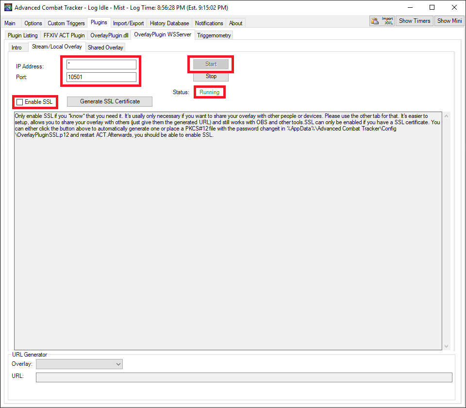

1. Set the IP address to `*`
2. Set the port to 10501
3. Click the "Start" button
4. Make sure the status says "Running"

## Download and Install Triggevent

1. Head to the [Triggevent Releases Page](https://github.com/xpdota/event-trigger/releases) and download the latest `triggevent-win.zip`.
2. Extract the zip file somewhere.
3. In The ACT Plugins tab, click "Browse", locate the `Triggevent_Stub.dll` file you extracted in step 2, then click "Add/Enable Plugin" (this will make it automatically start when you open ACT).
4. If prompted for an update, then do so.
   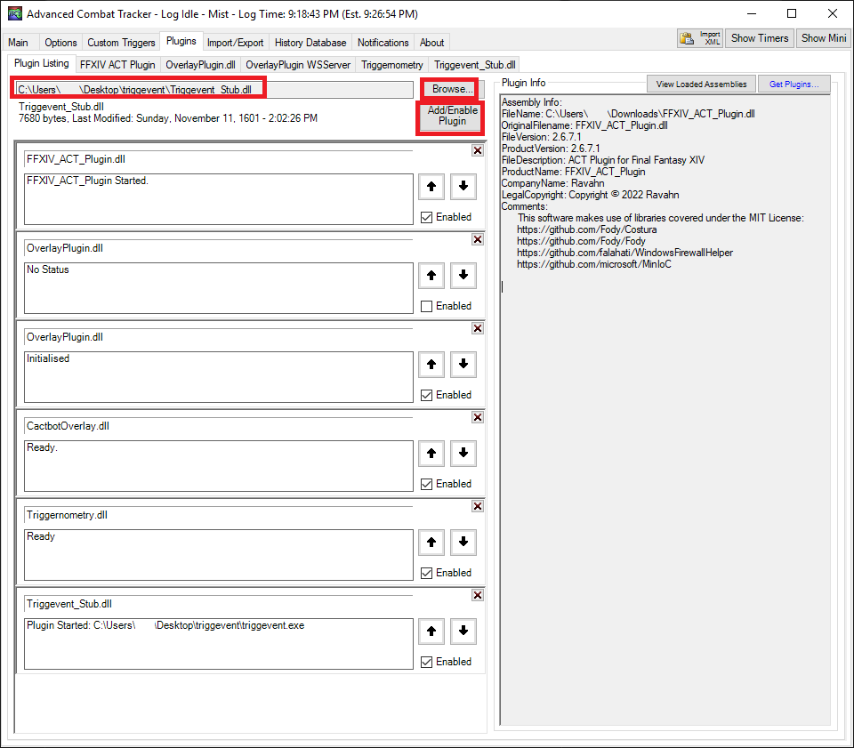

## Configure Triggevent

First, look at the front page:

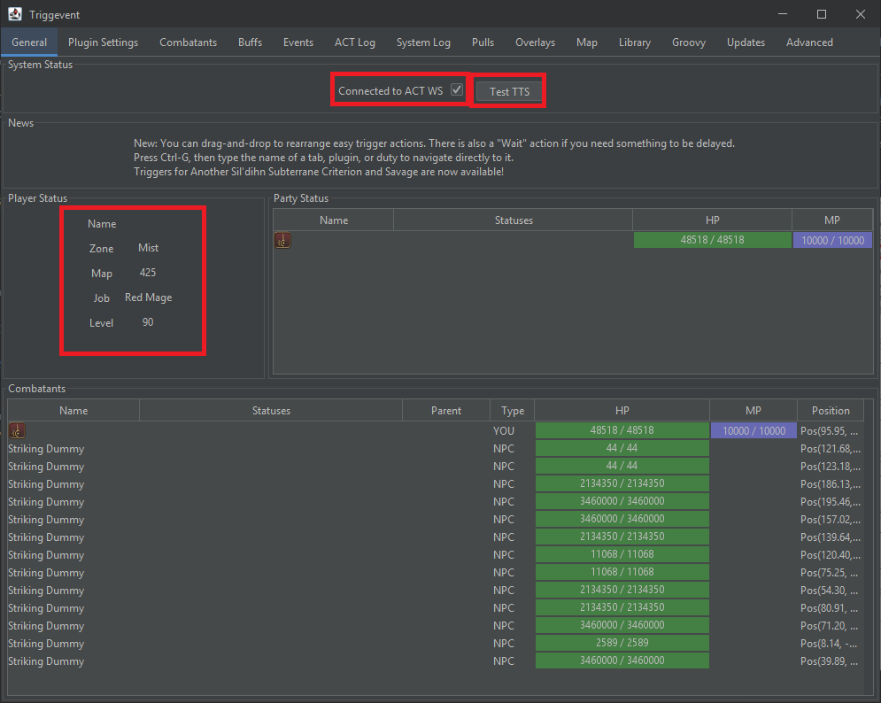

1. Make sure the "Connected to ACT WS" checkbox is selected (if the box is not checked - it means there is a problem).
2. Make sure the "Player Status" section displays the correct data.
3. If you plan to use any TTS/callout features, click the "Test TTS" button and make sure it works.

Now, let's get started configuring it.

## Duty Callouts

By default, Cactbot-style TTS callouts are enabled.

You can disable callouts by navigating to Plugin Settings > Duties > Any duty, and unchecking "Enable By Default" at the top:

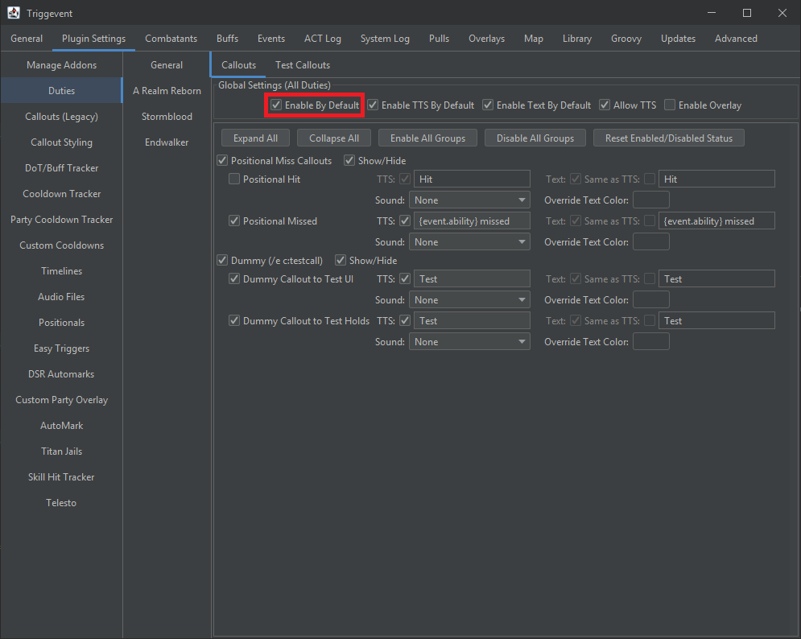

Or, leave them on if you'd like callouts.

## Titan Jails

1. Navigate to Plugin Settings > Duties > Stormblood > Ultimate Raid > Weapon's Refrain > Titan Gaols.
2. While you can set up the priority any way you like, if you plan to only use personal callouts, then
   it is recommended for everyone to use the default so that you don't need
   to bother with importing/exporting and sharing with other players.
   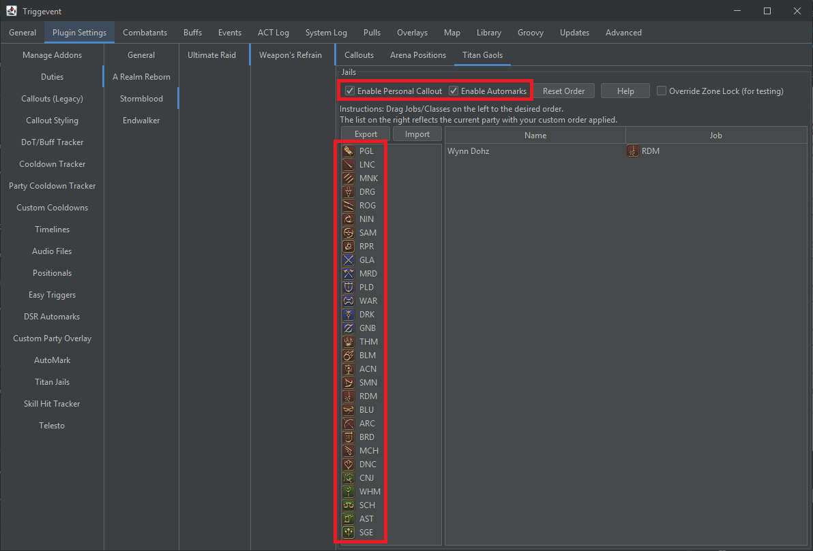
3. If you'd like personal callouts, check the "Enable Personal Callout" checkbox, then go back to the
   "Callouts" tab and make sure you enable the individual callouts:
   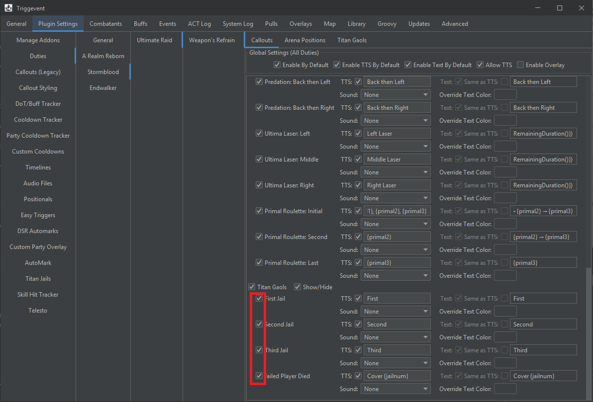
4. If you'd like Automarkers, check the "Enable Automarks" box (you can use both), and then keep
   reading below.

### Extra Automarker Setup

Head to the Plugin Settings > AutoMark tab.

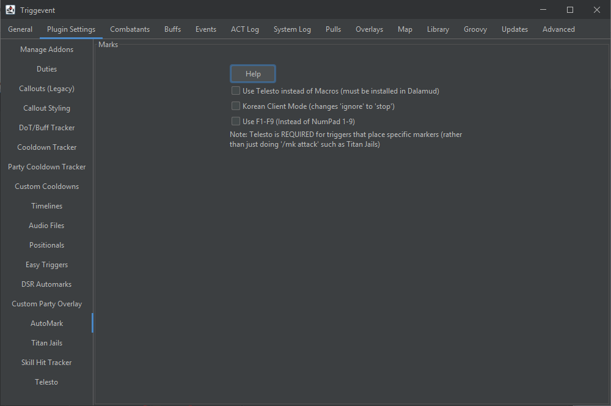

You need to choose one of two methods of placing the markers: Telesto (Dalamud Plugin), or the classic macros.
Telesto is recommended because there are less things that can go wrong, and also supports more advanced markers
for things like the Wroth Flames automarkers, which use more than just the 1/2/3/4/5 markers.

#### Newer Style - Telesto

The modern way of placing markers is to use the Dalamud plugin [Telesto](https://github.com/paissaheavyindustries/Telesto).

Make sure the Telesto settings in-game look like this:

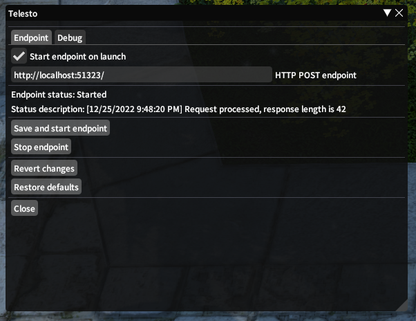

1. Head to Plugin Settings > Telesto. 
2. Click the "Test" button, and make sure it was successful. 
3. Check "Enable Party List":

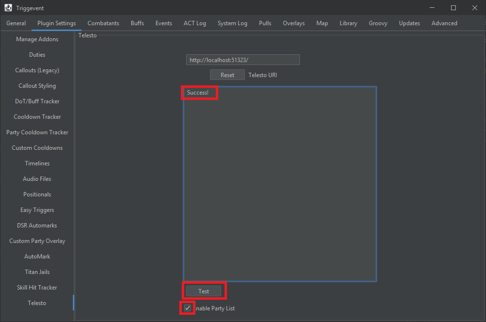

Then, head back to the AutoMarks tab, and check "Use Telesto Instead of Macros":

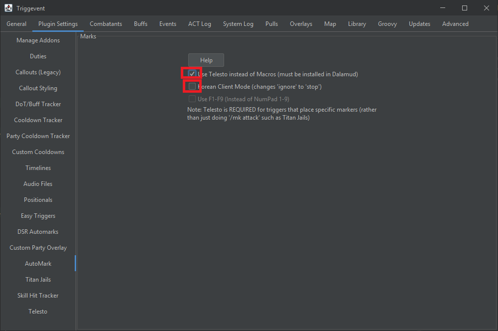

While not needed for the Titan Jails, if you use the Korean client, tick the checkbox for that.

Finally, test it by using the command `/e c:amtest 1`. You should see the '1' marker appear on your head.

#### Older Style - Macros

You can also, where you configure nine macros (one for each party slot, and one to clear). To see how to do this, press the "Help" button
on this screen. It will give you instructions on how to set up the macros in-game.

Once you have the macros set up and bound to either Numpad1-9 or F1-F9, enable or disable the checkbox here accordingly:

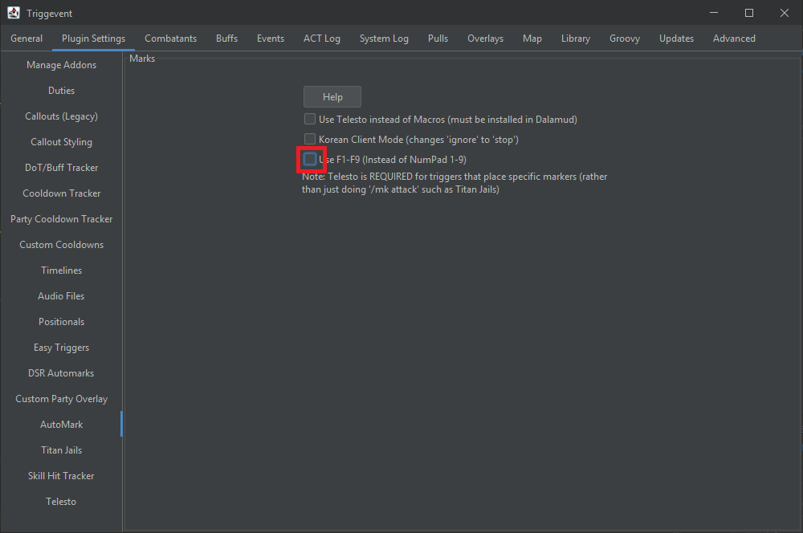

Lastly, head to Advanced > Party, and make sure the party sort order matches your in-game settings. 

Finally, test it by using the command `/e c:amtest 1`. You should see the '1' marker appear on your head.

## Other Features

Triggevent has many features, so be sure to check everything else out!

Here are some examples:

- [Cooldown Tracker](../Cooldown-Tracker.md) - Personal + Party Cooldown tracker.
- [DoT Tracker](../Dot-Tracker.md) - Multi-target DoT tracker + DoT tick tracker.
- [Timeline Customization](../Timeline-Customization.md) - Triggevent's extensions of Cactbot Timelines.
- [Dragonsong Triggers, including Wroth Flames Automarker](../Dragonsong-Triggers.md) - Overview of DSR callouts and wroth flames auto marks.
