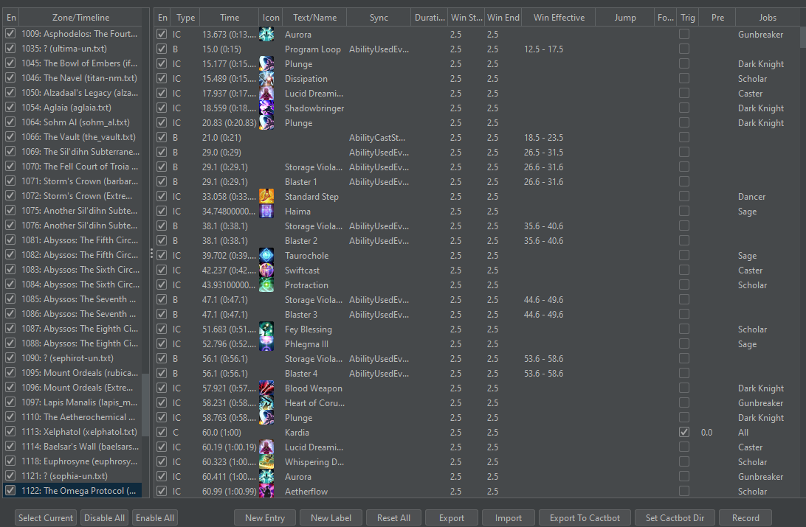

# Timeline Recording

In addition to the normal timeline abilities, such as the overlay, triggers, and the ability to export your timeline customizations back to Cactbot, you can
also use a log file or FFLogs report to add mitigation entries to your timeline automatically.

First, start by importing your report. You can import by running triggevent-import.exe, and then importing the ACT log file. You can also drag-and-drop it.

If you want to use an FFLogs report, you should first open Triggevent normally, and put your FFLogs API information into the Advanced > FFLogs tab.

Once you have the report imported, play the log using the controls at the top until you are at the beginning of the pull you wish to use as the basis for your mitigation.
Since FFLogs imports only cover a single pull, you only need to do this if using an ACT log.

Then, go to Plugin Settings > Timelines. Click the 'Record' button in the bottom-right. You will get a confirmation. Click 'Run', and let it record your mitigations.

Once it finishes playing through the pull, it will tell you how many timeline entries it collected via the recording. Click 'Cancel' to discard these, or 'Accept' to add them.
If you have already used the Recording feature for this zone, the recording will **replace** existing entries.

After accepting, you'll see your new entries added to the timeline:

However, there are a few things you may wish to customize:

- Pre-pull abilities, as well as anything used prior to the first timeline sync. You may wish to delete or manually fix these up.
- By default, each entry is locked to the job or role associated to that cooldown. If you are playing Gunbreaker, for example, you will only 
  see GNB and general tank cooldowns.
- Entries do not have a trigger enabled by default. That is, they will show up in the overlay, but will not cause a callout/alert. 
  To have an alert, check the box in the 'Trig' column. You probably want the alert to warn you in advance, so you can set how far in advance
  you want the callout to be in the 'Pre' column.

## What Abilities Are Captured?

Anything that Triggevent considers to be a 'cooldown' is captured. You can add more abilities as custom cooldowns under 'Plugin Settings' > 'Custom Cooldowns'.

## Exporting to Cactbot

To export your customizations back to Cactbot, use the 'Export to Cactbot' button. This assumes your Cactbot user file directory is in the usual place.
If it is not, 